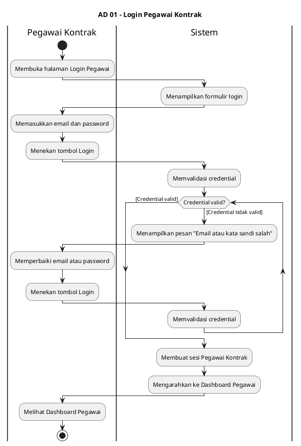
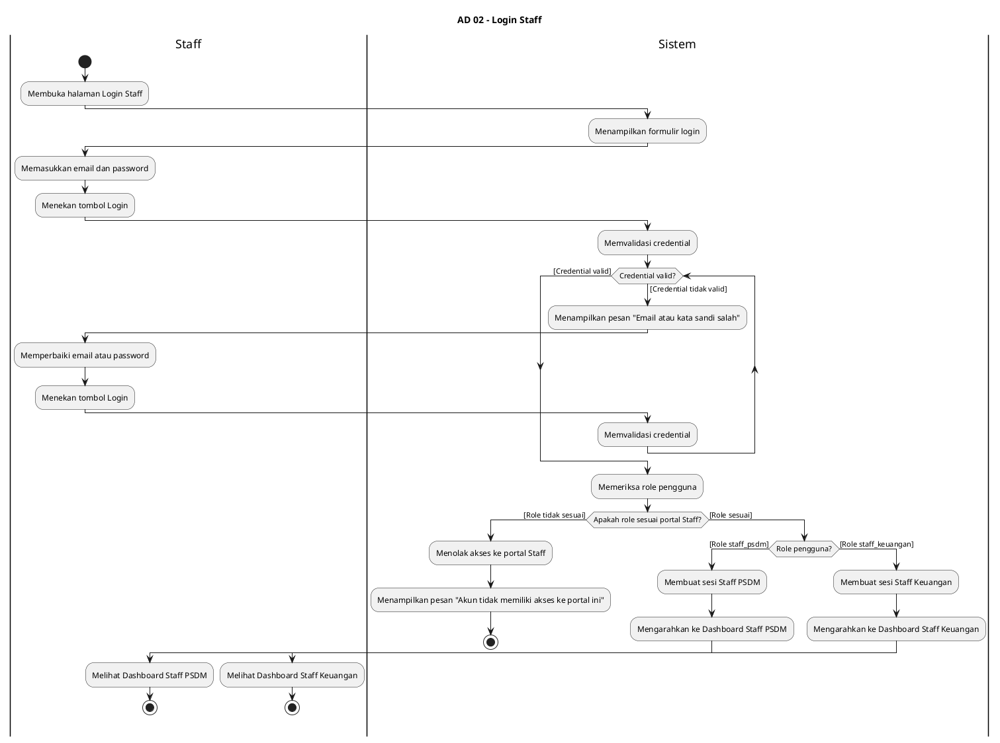
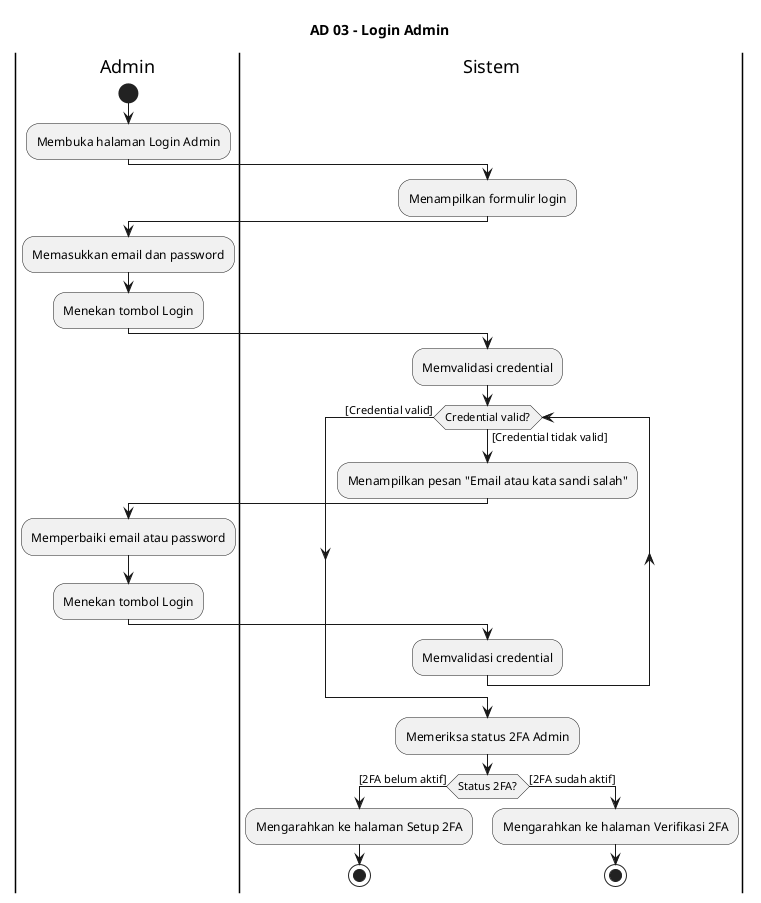
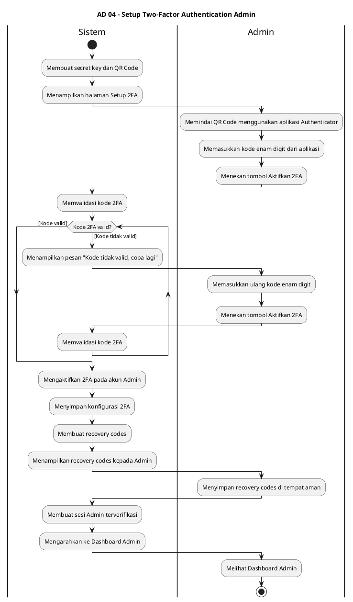
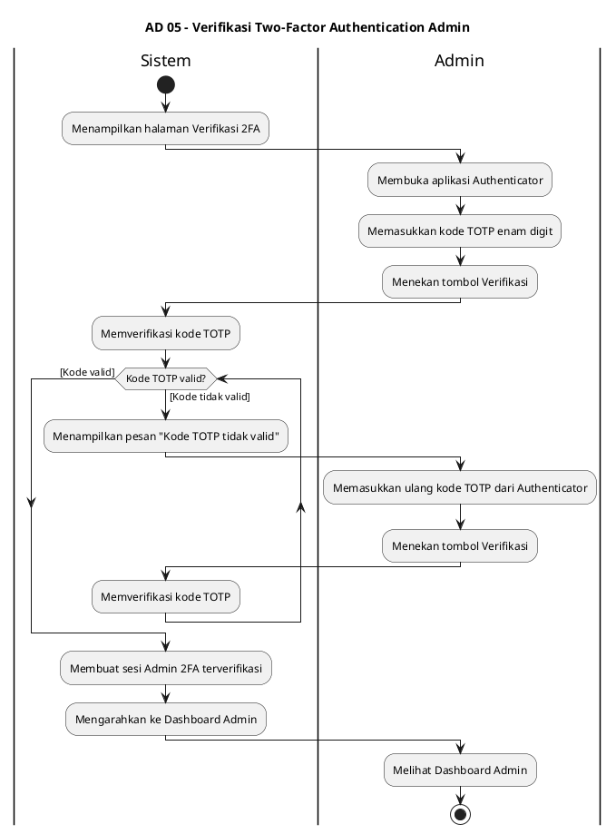

# Activity Diagram — Revisi Lengkap PlantUML Swimlane
# Sistem Informasi Presensi dan Penggajian Pegawai Kontrak TVRI

> Revisi mengikuti panduan UML Activity Diagram: guard condition, while loop, swimlane tepat
> Format: PlantUML Activity Diagram dengan swimlane vertikal
> Render: https://www.plantuml.com/plantuml/uml/ atau plugin VS Code PlantUML

---

## Batch 1 — Fungsi 01 sampai 05

---

### AD 01 — Login Pegawai Kontrak

---

### AD 02 — Login Staff

---

### AD 03 — Login Admin

---

### AD 04 — Setup Two-Factor Authentication Admin

---

### AD 05 — Verifikasi Two-Factor Authentication Admin

---

## Batch 2 — Fungsi 06 sampai 10

*(Menunggu instruksi untuk melanjutkan)*

---

## Batch 3 dan seterusnya

*(Menunggu instruksi untuk melanjutkan)*
