# Dokumentasi Lengkap Sistem Website Absensi Pegawai Kontrak TVRI

---

## Daftar Isi

1. [Gambaran Umum Website](#1-gambaran-umum-website)
2. [Daftar Role atau Pengguna](#2-daftar-role-atau-pengguna)
3. [Fitur Utama Website](#3-fitur-utama-website)
4. [Alur Kerja Sistem Secara Umum](#4-alur-kerja-sistem-secara-umum)
5. [Alur Per Fitur](#5-alur-per-fitur)
6. [Flowchart Per Fitur](#6-flowchart-per-fitur)
7. [Struktur Database](#7-struktur-database)
8. [Struktur Folder dan File Penting](#8-struktur-folder-dan-file-penting)
9. [Penjelasan Backend](#9-penjelasan-backend)
10. [Penjelasan Frontend](#10-penjelasan-frontend)
11. [Alur CRUD](#11-alur-crud)
12. [Alur Login dan Hak Akses](#12-alur-login-dan-hak-akses)
13. [Alur Error dan Validasi](#13-alur-error-dan-validasi)
14. [Ringkasan Sistem dalam Bentuk Narasi](#14-ringkasan-sistem-dalam-bentuk-narasi)
15. [Kesimpulan Sistem](#15-kesimpulan-sistem)
16. [Use Case Diagram](#16-use-case-diagram)
17. [Activity Diagram](#17-activity-diagram)
18. [Output Akhir – Rangkuman Susunan Dokumentasi](#18-output-akhir--rangkuman-susunan-dokumentasi)

---

## 1. Gambaran Umum Website

### Nama Sistem
**Sistem Informasi Presensi dan Penggajian Pegawai Kontrak TVRI** (TVRI Presensi)

### Tujuan Utama Website
Membangun sistem pencatatan kehadiran (presensi) pegawai kontrak TVRI yang berbasis lokasi GPS, dengan fitur anti-kecurangan (deteksi Fake GPS / Mock Location), manajemen pengajuan cuti dan dinas luar, serta pengelolaan slip gaji (payroll) digital secara terintegrasi dalam satu platform web.

### Target Pengguna
| No | Pengguna | Keterangan |
|----|----------|------------|
| 1 | Pegawai Kontrak TVRI | Pengguna utama (absensi, lihat gaji, ajukan cuti/dinas luar) |
| 2 | Staff PSDM (Personalia) | Mengelola data pegawai, memproses cuti/dinas luar, memantau presensi |
| 3 | Staff Keuangan | Mengelola data gaji, input/import slip gaji, tanda tangan digital |
| 4 | Administrator Sistem | Mengatur konfigurasi lokasi, shift, kelola akun staff & admin |

### Masalah yang Diselesaikan
1. **Kecurangan Presensi**: Pencatatan kehadiran manual rentan terhadap manipulasi. Sistem ini menggunakan validasi GPS dan deteksi fake GPS (mock location) untuk memastikan pegawai benar-benar berada di area kantor saat melakukan presensi.
2. **Pengelolaan Shift yang Kompleks**: Pegawai kontrak TVRI memiliki variasi jam kerja (normal, shift bergilir, bebas 24 jam). Sistem ini mengakomodasi tiga tipe jadwal kerja termasuk shift lintas tengah malam.
3. **Proses Cuti & Dinas Manual**: Pengajuan cuti dan perjalanan dinas sebelumnya dilakukan secara manual dengan kertas. Sistem ini mendigitalkan proses pengajuan, persetujuan, dan pencatatan otomatis ke rekap presensi.
4. **Rekapitulasi Gaji yang Rumit**: Perhitungan potongan gaji (KPPN, BPJS, Koperasi, Kasbon, dll.) yang sebelumnya dikerjakan manual kini otomatis dan terintegrasi dengan data kehadiran.
5. **Tidak Ada Jejak Audit**: Tidak ada riwayat siapa yang mengubah data apa. Sistem ini mencatat seluruh aktivitas penting dalam Activity Log.

### Manfaat Website
- Meningkatkan akurasi dan integritas data kehadiran pegawai kontrak
- Menghemat waktu staf PSDM dan Keuangan dalam rekapitulasi bulanan
- Mencegah kecurangan lokasi presensi melalui validasi GPS dan geofencing
- Memberikan transparansi slip gaji digital yang bisa diunduh dalam format PDF
- Menyediakan sistem notifikasi real-time untuk pengajuan cuti, dinas luar, dan pengumuman
- Mendukung ekspor data ke format Excel untuk kebutuhan pelaporan

---

## 2. Daftar Role atau Pengguna

Sistem ini memiliki **4 role utama** yang dikelola melalui kolom `role` pada tabel `users`.

### 2.1 Admin (`role = 'admin'`)

| Aspek | Keterangan |
|-------|------------|
| **Hak Akses** | Akses penuh ke seluruh konfigurasi sistem |
| **Fitur** | Dashboard admin, pengaturan lokasi geofencing (lat/long/radius), manajemen shift kerja, presensi manual darurat, kelola akun staff & admin lain, master data, activity log, monitor presensi (read-only), lihat cuti (read-only), ekspor presensi |
| **Batasan** | Tidak bisa menghapus akun diri sendiri |
| **Keamanan** | Wajib mengaktifkan Two-Factor Authentication (2FA) berbasis TOTP saat pertama kali login |
| **Login** | Melalui halaman `/admin/login` |

### 2.2 Staff PSDM (`role = 'staff_psdm'`)

| Aspek | Keterangan |
|-------|------------|
| **Hak Akses** | Mengelola data kepegawaian dan operasional presensi |
| **Fitur** | Dashboard statistik presensi harian + grafik mingguan, CRUD data pegawai (user), import pegawai dari Excel, CRUD pengumuman, monitor presensi + hapus record + ekspor Excel, manajemen master data PSDM (jabatan/bagian/status), manajemen pengajuan cuti (approve/reject + notifikasi email), manajemen dinas luar (approve/reject), absen manual untuk pegawai |
| **Batasan** | Tidak bisa mengakses menu keuangan/gaji, tidak bisa mengelola akun admin atau staff lain |
| **Login** | Melalui halaman `/staff/login` |

### 2.3 Staff Keuangan (`role = 'staff_keuangan'`)

| Aspek | Keterangan |
|-------|------------|
| **Hak Akses** | Mengelola data keuangan dan penggajian |
| **Fitur** | Dashboard statistik gaji bulanan, input gaji manual per pegawai (dengan rincian potongan dinamis), input gaji massal (bulk), import gaji dari Excel, download template Excel, edit/hapus gaji, tanda tangan digital slip gaji (individual & massal), kelola jenis potongan gaji, lihat profil keuangan pegawai, ekspor rekap gaji ke Excel |
| **Batasan** | Tidak bisa mengakses menu kepegawaian/PSDM, tidak bisa mengakses menu admin |
| **Login** | Melalui halaman `/staff/login` |

### 2.4 User / Pegawai Kontrak (`role = 'user'`)

| Aspek | Keterangan |
|-------|------------|
| **Hak Akses** | Fitur self-service terbatas untuk kegiatan operasional harian |
| **Fitur** | Dashboard dengan pengumuman, status presensi hari ini, statistik bulanan, dan info shift; Absen masuk/pulang berbasis GPS + foto selfie; Rekap presensi bulanan + ekspor Excel; Lihat slip gaji + unduh PDF (hanya yang sudah ditandatangani); Pengajuan cuti (dengan validasi saldo cuti tahunan) + upload lampiran; Pengajuan dinas luar + upload lampiran SPPD; Edit profil + foto profil; Notifikasi in-app |
| **Batasan** | Tidak bisa mengakses halaman admin/staff, tidak bisa mengubah data pegawai lain, hanya bisa membatalkan pengajuan sendiri yang masih berstatus *pending* |
| **Login** | Melalui halaman `/login` |

### Perbedaan Antar Role (Ringkasan Matriks)

| Fitur | Admin | Staff PSDM | Staff Keuangan | User |
|-------|:-----:|:----------:|:--------------:|:----:|
| Pengaturan Lokasi & Shift | ✅ | ❌ | ❌ | ❌ |
| Kelola Akun Staff/Admin | ✅ | ❌ | ❌ | ❌ |
| CRUD Data Pegawai | ❌ | ✅ | ❌ | ❌ |
| Import Pegawai Excel | ❌ | ✅ | ❌ | ❌ |
| CRUD Pengumuman | ❌ | ✅ | ❌ | ❌ |
| Approve/Reject Cuti | ❌ | ✅ | ❌ | ❌ |
| Approve/Reject Dinas Luar | ❌ | ✅ | ❌ | ❌ |
| Monitor Presensi | ✅ (read) | ✅ (full) | ❌ | ❌ |
| Absen Manual | ✅ | ✅ | ❌ | ❌ |
| Input/Import Gaji | ❌ | ❌ | ✅ | ❌ |
| Tanda Tangan Slip Gaji | ❌ | ❌ | ✅ | ❌ |
| Kelola Jenis Potongan | ❌ | ❌ | ✅ | ❌ |
| Absen GPS + Foto | ❌ | ❌ | ❌ | ✅ |
| Ajukan Cuti/Dinas | ❌ | ❌ | ❌ | ✅ |
| Lihat Slip Gaji (PDF) | ❌ | ❌ | ❌ | ✅ |
| Activity Log | ✅ | ❌ | ❌ | ❌ |
| 2FA Wajib | ✅ | ❌ | ❌ | ❌ |
| Master Data PSDM | ✅ | ✅ | ❌ | ❌ |

---

## 3. Fitur Utama Website

### 3.1 Login Multi-Portal

| Aspek | Detail |
|-------|--------|
| **Nama Fitur** | Login Multi-Portal |
| **Tujuan** | Menyediakan pintu masuk terpisah untuk setiap kategori pengguna |
| **Pengguna** | Semua role |
| **Input** | Email, Password |
| **Proses** | Sistem memvalidasi credential, mengecek role user, jika admin → wajib 2FA, lalu mengarahkan ke dashboard sesuai role |
| **Output** | Redirect ke dashboard masing-masing role |
| **Halaman** | `/login` (User), `/staff/login` (Staff), `/admin/login` (Admin) |

### 3.2 Two-Factor Authentication (2FA)

| Aspek | Detail |
|-------|--------|
| **Nama Fitur** | Autentikasi Dua Faktor (TOTP) |
| **Tujuan** | Mengamankan akun Admin dengan lapisan keamanan tambahan |
| **Pengguna** | Admin |
| **Input** | Kode 6 digit dari aplikasi authenticator (Google Authenticator, dll.) |
| **Proses** | Saat pertama login, admin diarahkan ke halaman setup 2FA → scan QR Code → input kode verifikasi → 2FA aktif. Login berikutnya selalu meminta kode 2FA. Recovery codes tersedia untuk keadaan darurat. |
| **Output** | Sesi `2fa_verified` aktif, akses ke dashboard admin dibuka |
| **Halaman** | `/two-factor/setup`, `/two-factor/verify`, `/two-factor/recovery` |

### 3.3 Presensi Berbasis GPS dan Foto Selfie

| Aspek | Detail |
|-------|--------|
| **Nama Fitur** | Check-In dan Check-Out Presensi |
| **Tujuan** | Mencatat kehadiran pegawai dengan bukti lokasi GPS dan foto selfie real-time |
| **Pengguna** | User (Pegawai Kontrak) |
| **Input** | Koordinat GPS (latitude, longitude, accuracy), deteksi mock location, foto selfie (maks 5MB) |
| **Proses** | 1. Validasi fake GPS (mock location terdeteksi → tolak). 2. Validasi akurasi GPS (0m atau >200m → tolak). 3. Hitung jarak user ke titik kantor menggunakan rumus Haversine. 4. Jika jarak > radius yang diizinkan → tolak. 5. Tentukan shift yang berlaku berdasarkan tipe kehadiran user. 6. Tentukan status terlambat berdasarkan toleransi menit shift. 7. Hitung waktu minimum checkout (8 jam kerja) dan maksimum checkout (shift end + 3 jam). 8. Simpan foto dan record attendance ke database (dengan proteksi race condition via DB transaction + lock). |
| **Output** | Record kehadiran tersimpan, status: `present` (Tepat Waktu), `late` (Terlambat), atau `left` (Meninggalkan Kantor jika melewati batas max checkout) |
| **Halaman** | `/attendance` |

### 3.4 Tiga Tipe Jadwal Kehadiran

| Aspek | Detail |
|-------|--------|
| **Nama Fitur** | Manajemen Tipe Kehadiran (Normal, Shift, Umum) |
| **Tujuan** | Mengakomodasi perbedaan jam kerja antar jenis pegawai |
| **Pengguna** | User (otomatis berdasarkan konfigurasi), Staff PSDM (mengatur) |
| **Tipe** | **Normal** = jam kantor tetap (misal 08:00–16:00); **Shift** = jadwal bergilir dengan deteksi otomatis shift aktif berdasarkan waktu saat check-in (mendukung shift lintas tengah malam); **Umum** = bebas 24 jam tanpa batasan waktu masuk, tidak pernah dianggap terlambat |
| **Proses** | Saat check-in, sistem membaca `attendance_type` user → menentukan shift yang berlaku → menghitung min/max checkout → menentukan status keterlambatan |
| **Output** | Kalkulasi shift otomatis, status presensi sesuai aturan masing-masing tipe |

### 3.5 Manajemen Pengajuan Cuti

| Aspek | Detail |
|-------|--------|
| **Nama Fitur** | Pengajuan Cuti/Izin |
| **Tujuan** | Mendigitalkan proses pengajuan, validasi saldo, persetujuan, dan pencatatan cuti ke rekap presensi |
| **Pengguna** | User (mengajukan), Staff PSDM (approve/reject) |
| **Input** | Tipe cuti (Cuti Tahunan, Sakit, Alasan Penting, Lainnya), tanggal mulai & berakhir, alasan, lampiran (opsional, maks 5MB: jpg/png/pdf/doc) |
| **Proses** | 1. Validasi overlap dengan cuti/dinas lain yang pending/approved. 2. Untuk cuti tahunan: cek saldo cuti (default 12 hari/tahun), hitung hari kerja yang dibutuhkan. 3. Simpan pengajuan dengan status `pending`. 4. Kirim notifikasi in-app ke semua Staff PSDM. 5. Saat Staff PSDM meng-approve: auto-buat record attendance `status=cuti` untuk setiap hari kerja dalam rentang cuti, kurangi saldo cuti, kirim notifikasi + email ke pegawai. 6. Saat Staff PSDM me-reject: wajib isi alasan penolakan, kirim notifikasi + email ke pegawai. |
| **Output** | Status cuti berubah (Pending → Approved / Rejected), record presensi otomatis terisi, saldo cuti berkurang |
| **Halaman** | `/cuti` (User), `/staff/psdm/leaves` (Staff PSDM) |

### 3.6 Manajemen Perjalanan Dinas Luar

| Aspek | Detail |
|-------|--------|
| **Nama Fitur** | Pengajuan Dinas Luar |
| **Tujuan** | Mencatat dan memproses pengajuan perjalanan dinas di luar kantor |
| **Pengguna** | User (mengajukan), Staff PSDM (approve/reject) |
| **Input** | Tanggal mulai & berakhir, tujuan, maksud/tujuan, lampiran SPPD (opsional) |
| **Proses** | Mirip alur cuti: validasi overlap → simpan pending → notifikasi Staff PSDM → approve (auto-buat record attendance `status=dinas_luar`) / reject |
| **Output** | Record perjalanan dinas tersimpan, presensi otomatis terisi untuk setiap hari kerja dalam rentang dinas |
| **Halaman** | `/dinas-luar` (User), `/staff/psdm/business-trips` (Staff PSDM) |

### 3.7 Manajemen Data Pegawai (CRUD + Import Excel)

| Aspek | Detail |
|-------|--------|
| **Nama Fitur** | Kelola Data Pegawai |
| **Tujuan** | Mengelola biodata dan konfigurasi akun seluruh pegawai kontrak |
| **Pengguna** | Staff PSDM |
| **Input** | Nama, NIP (18 digit), NIK (16 digit), email, password, tipe absen (normal/shift/umum), jenis kelamin, alamat, jabatan, bagian, status pegawai (dari Master Data PSDM) |
| **Proses** | CRUD standar + fitur import massal dari file Excel (.xlsx/.xls/.csv) + hapus massal (bulk delete) dengan pembersihan data terkait (attendance, salary, leave, notification) |
| **Output** | Data pegawai tersimpan/terupdate/terhapus di database |
| **Halaman** | `/staff/psdm/users`, `/staff/psdm/users/create`, `/staff/psdm/users/{user}/edit`, `/staff/psdm/users/import` |

### 3.8 Manajemen Penggajian (Payroll)

| Aspek | Detail |
|-------|--------|
| **Nama Fitur** | Input, Import, dan Pengelolaan Slip Gaji |
| **Tujuan** | Mencatat dan mengelola data gaji bulanan pegawai kontrak beserta rincian potongan |
| **Pengguna** | Staff Keuangan |
| **Input** | Pegawai, bulan/tahun, gaji pokok, potongan KPPN, rincian potongan intern (dinamis: Koperasi, BPJS, Kasbon, dll.), gaji diterima, catatan |
| **Proses** | 1. Input manual per pegawai dengan potongan dinamis. 2. Input massal (bulk) untuk banyak pegawai sekaligus. 3. Import dari file Excel menggunakan template. 4. Validasi: total potongan ≤ gaji pokok, gaji diterima = gaji pokok − total potongan. 5. Tanda tangan digital oleh Staff Keuangan (wajib upload gambar tanda tangan terlebih dahulu). 6. Status gaji: Draft → Paid (setelah ditandatangani). 7. Slip gaji yang sudah ditandatangani bisa diunduh dalam format PDF oleh pegawai. |
| **Output** | Record gaji tersimpan dengan status, slip PDF dapat diunduh |
| **Halaman** | `/staff/keuangan/salaries/*`, `/staff/keuangan/salaries/import`, `/staff/keuangan/salaries/bulk` |

### 3.9 Pengumuman (Announcement)

| Aspek | Detail |
|-------|--------|
| **Nama Fitur** | Manajemen Pengumuman |
| **Tujuan** | Menyampaikan informasi penting dari manajemen kepada seluruh pegawai |
| **Pengguna** | Staff PSDM (membuat), User (melihat) |
| **Input** | Judul, isi konten, status aktif/nonaktif |
| **Proses** | CRUD pengumuman + toggle aktif/nonaktif. Saat pengumuman aktif dibuat, sistem mengirim notifikasi in-app ke semua pegawai. |
| **Output** | Pengumuman tampil di dashboard pegawai |
| **Halaman** | `/staff/psdm/announcements/*` |

### 3.10 Monitor Presensi & Ekspor Excel

| Aspek | Detail |
|-------|--------|
| **Nama Fitur** | Monitor Presensi Real-Time + Ekspor Rekap |
| **Tujuan** | Memantau kehadiran seluruh pegawai dan mengekspor rekap ke Excel |
| **Pengguna** | Admin (read-only), Staff PSDM (full + hapus + ekspor) |
| **Input** | Filter: tanggal, bulan/tahun, status kehadiran, pencarian nama/NIP |
| **Proses** | Menampilkan tabel presensi dengan pagination (20 per halaman), foto check-in/out, koordinat, status. Ekspor ke Excel dengan format tabel per pegawai per hari. |
| **Output** | Tabel data presensi terfilter, file Excel (.xlsx) |
| **Halaman** | `/admin/monitor`, `/staff/psdm/monitor` |

### 3.11 Pengaturan Lokasi & Shift (Admin)

| Aspek | Detail |
|-------|--------|
| **Nama Fitur** | Konfigurasi Geofencing dan Jadwal Shift |
| **Tujuan** | Mengatur parameter lokasi kantor dan aturan shift kerja |
| **Pengguna** | Admin |
| **Input** | Latitude kantor, Longitude kantor, Radius yang diizinkan (meter); Untuk shift: jam mulai, jam berakhir, toleransi keterlambatan (menit) |
| **Proses** | Simpan ke tabel `settings`. Setiap perubahan shift dicatat ke `shift_logs` (audit trail). |
| **Output** | Parameter geofencing dan shift tersimpan, berlaku untuk presensi berikutnya |
| **Halaman** | `/admin/settings` |

### 3.12 Master Data PSDM

| Aspek | Detail |
|-------|--------|
| **Nama Fitur** | Manajemen Master Data Referensi |
| **Tujuan** | Mengelola data referensi dropdown (jabatan, bagian, status pegawai) secara dinamis tanpa mengubah kode |
| **Pengguna** | Admin, Staff PSDM |
| **Input** | Kategori (nama, deskripsi, scope), Nilai (value, deskripsi) |
| **Proses** | CRUD kategori master data + CRUD nilai di dalam setiap kategori |
| **Output** | Data dropdown pada form pegawai terisi secara dinamis |
| **Halaman** | `/admin/master-data`, `/staff/psdm/master-data` |

### 3.13 Notifikasi In-App

| Aspek | Detail |
|-------|--------|
| **Nama Fitur** | Sistem Notifikasi Real-Time |
| **Tujuan** | Memberitahu pengguna tentang kejadian penting secara real-time |
| **Pengguna** | Semua role (menerima), Sistem (mengirim otomatis) |
| **Jenis Notifikasi** | Cuti disetujui/ditolak, dinas luar disetujui/ditolak, slip gaji tersedia, pengumuman baru, pengajuan cuti baru (ke Staff PSDM), pengajuan dinas baru (ke Staff PSDM) |
| **Proses** | Notifikasi dibuat otomatis oleh `NotificationService` saat event terjadi. Pengguna bisa menandai sebagai sudah dibaca (individual atau semua sekaligus). |
| **Output** | Badge notifikasi di header, daftar notifikasi dengan ikon & warna sesuai tipe |

### 3.14 Activity Log (Audit Trail)

| Aspek | Detail |
|-------|--------|
| **Nama Fitur** | Log Aktivitas Sistem |
| **Tujuan** | Mencatat riwayat perubahan data penting untuk kebutuhan audit |
| **Pengguna** | Admin (melihat) |
| **Data yang Dicatat** | User pelaku, jenis aksi (create/update/delete), model & ID yang terkena, deskripsi, nilai lama & baru (JSON), alamat IP |
| **Output** | Tabel log dengan filter berdasarkan aksi dan tanggal |
| **Halaman** | `/admin/activity-logs` |

### 3.15 Profil Pengguna

| Aspek | Detail |
|-------|--------|
| **Nama Fitur** | Edit Profil dan Foto Profil |
| **Tujuan** | Memungkinkan pengguna mengelola informasi akun pribadi |
| **Pengguna** | Semua role |
| **Input** | Nama, email, foto profil (JPEG/PNG/GIF, maks 2MB), password baru |
| **Proses** | Update data profil, upload/hapus foto profil, ganti password, hapus akun |
| **Output** | Data profil terupdate |
| **Halaman** | `/profile` |

### 3.16 Rekap Presensi Pegawai (Self-Service)

| Aspek | Detail |
|-------|--------|
| **Nama Fitur** | Rekap Presensi Pribadi |
| **Tujuan** | Memungkinkan pegawai melihat riwayat kehadiran sendiri dan mengunduh rekap |
| **Pengguna** | User |
| **Input** | Filter bulan/tahun |
| **Proses** | Query attendance milik user yang login berdasarkan filter bulan/tahun, hitung statistik (total hadir, terlambat, tepat waktu) |
| **Output** | Tabel rekap, statistik ringkasan, file Excel (.xlsx) |
| **Halaman** | `/rekap` |

---

## 4. Alur Kerja Sistem Secara Umum

Berikut adalah alur kerja sistem dari perspektif pengguna secara umum:

1. **Pengguna membuka website** → Sistem secara otomatis mengarahkan (`redirect`) ke halaman login.
2. **Pengguna melakukan login** → Memasukkan email dan password pada halaman login sesuai perannya (`/login` untuk pegawai, `/staff/login` untuk staff, `/admin/login` untuk admin).
3. **Sistem memvalidasi credential** → Mengecek kecocokan email dan password (menggunakan bcrypt dengan 12 rounds).
4. **Sistem mengecek role pengguna** → Membaca kolom `role` pada tabel `users`.
5. **Jika role = admin** → Sistem mengecek status 2FA. Jika belum setup → diarahkan ke halaman setup 2FA. Jika sudah setup → diminta memasukkan kode 6 digit TOTP. Setelah verifikasi berhasil → masuk ke Dashboard Admin.
6. **Jika role = staff_psdm** → Masuk ke Dashboard Staff PSDM (statistik presensi harian, grafik, pengumuman).
7. **Jika role = staff_keuangan** → Masuk ke Dashboard Staff Keuangan (statistik gaji, daftar gaji terbaru).
8. **Jika role = user** → Masuk ke Dashboard Pegawai (pengumuman, status presensi hari ini, statistik bulanan, info shift).
9. **Pengguna memilih fitur dari menu** → Navigasi sidebar menampilkan menu sesuai role.
10. **Pengguna mengisi/mengelola data** → Sistem memvalidasi input (server-side).
11. **Sistem memproses data** → Menjalankan logika bisnis (kalkulasi shift, validasi GPS, pengecekan saldo cuti, dll.).
12. **Data tersimpan ke database** → Menggunakan Eloquent ORM dengan proteksi SQL Injection dan race condition (DB transaction + lockForUpdate).
13. **Sistem menampilkan feedback** → Pesan sukses/error ditampilkan ke pengguna.
14. **Sistem mengirim notifikasi** → Jika terjadi event penting (cuti diajukan/diproses, gaji tersedia, pengumuman baru).
15. **Pengguna/Admin dapat melihat laporan** → Rekap presensi, rekap gaji, activity log — bisa difilter dan diekspor ke Excel/PDF.
16. **Pengguna melakukan logout** → Sesi diinvalidasi, token di-regenerasi, pengguna diarahkan kembali ke halaman login.

---

## 5. Alur Per Fitur

### 5.1 Fitur: Check-In Presensi

| Aspek | Detail |
|-------|--------|
| **Aktor** | User (Pegawai Kontrak) |
| **Langkah-langkah** | 1. User membuka halaman `/attendance`. 2. Sistem mengecek apakah user sudah absen hari ini (berdasarkan `work_date`). 3. Jika belum, tombol "Absen Masuk" aktif. 4. User mengizinkan akses lokasi GPS di browser. 5. Sistem menampilkan peta dengan posisi user dan lingkaran radius kantor. 6. User mengambil foto selfie melalui kamera depan. 7. User menekan tombol "Absen Masuk". 8. Sistem mengirim data: latitude, longitude, accuracy, is_mock_location, foto. 9. Server memvalidasi: mock location? akurasi valid? jarak dalam radius? 10. Server menentukan shift, status keterlambatan, dan menyimpan record. 11. Sistem menampilkan pesan sukses beserta informasi jam minimum checkout. |
| **Kondisi Berhasil** | Record attendance tersimpan dengan status `present` atau `late`, foto tersimpan di storage |
| **Kondisi Gagal** | Mock location terdeteksi, akurasi GPS 0m atau >200m, di luar radius kantor, sudah absen hari ini, sedang cuti/dinas luar, di luar jam kerja shift |
| **Data yang Disimpan** | `attendances`: user_id, shift_id, attendance_type, photo_path, check_in_time, work_date, latitude, longitude, location_accuracy, is_mock_location, status, min_check_out_time, max_check_out_time |

### 5.2 Fitur: Check-Out Presensi

| Aspek | Detail |
|-------|--------|
| **Aktor** | User (Pegawai Kontrak) |
| **Langkah-langkah** | 1. User membuka halaman `/attendance`. 2. Sistem mengecek apakah ada attendance aktif (belum checkout) dalam 24 jam terakhir. 3. Sistem mengecek apakah waktu minimum checkout sudah terpenuhi. 4. Jika sudah, tombol "Absen Pulang" aktif. 5. User mengambil foto selfie checkout. 6. User menekan tombol "Absen Pulang". 7. Server memvalidasi GPS dan jarak (sama seperti check-in). 8. Server menyimpan waktu checkout, foto, dan koordinat checkout. |
| **Kondisi Berhasil** | Waktu checkout dan foto tersimpan |
| **Kondisi Gagal** | Belum absen masuk, waktu kerja minimum belum terpenuhi, batas waktu checkout terlewat (status otomatis berubah ke `left`), mock location, di luar radius |
| **Data yang Diubah** | `attendances`: check_out_time, check_out_photo_path, check_out_latitude, check_out_longitude, check_out_location_accuracy |

### 5.3 Fitur: Pengajuan Cuti

| Aspek | Detail |
|-------|--------|
| **Aktor** | User (mengajukan), Staff PSDM (memproses) |
| **Langkah-langkah** | 1. User membuka `/cuti/create`. 2. User memilih tipe cuti, tanggal mulai/berakhir, mengisi alasan, upload lampiran (opsional). 3. Sistem memvalidasi: tanggal ≥ hari ini, tidak overlap dengan cuti/dinas lain yang pending/approved. 4. Jika tipe = cuti tahunan: sistem menghitung hari kerja yang dibutuhkan dan mengecek saldo cuti. 5. Record cuti tersimpan dengan status `pending`. 6. Notifikasi dikirim ke semua Staff PSDM. 7. Staff PSDM membuka `/staff/psdm/leaves` → melihat daftar pengajuan. 8. Staff PSDM klik "Setujui" → sistem auto-buat record attendance `status=cuti` untuk setiap hari kerja, kurangi saldo cuti (jika cuti tahunan), kirim notifikasi + email ke pegawai. ATAU klik "Tolak" → isi alasan → kirim notifikasi + email. |
| **Kondisi Berhasil** | Cuti disetujui, attendance otomatis terisi, saldo berkurang |
| **Kondisi Gagal** | Overlap tanggal, saldo cuti tidak cukup, cuti sudah diproses sebelumnya |
| **Data yang Disimpan** | `leaves`, `attendances` (auto-created), `leave_balances` (updated), `notifications` |

### 5.4 Fitur: Input Gaji Manual

| Aspek | Detail |
|-------|--------|
| **Aktor** | Staff Keuangan |
| **Langkah-langkah** | 1. Staff Keuangan buka `/staff/keuangan/salaries/input` → pilih pegawai. 2. Redirect ke form input gaji per pegawai. 3. Isi: gaji pokok, potongan KPPN, rincian potongan intern per jenis (Koperasi, BPJS, Kasbon, dll. — dinamis dari tabel `deduction_types`). 4. Sistem menghitung total potongan dan gaji akhir secara otomatis. 5. Klik simpan → sistem memvalidasi: duplikat periode? total potongan ≤ gaji pokok? 6. Simpan record `salaries` + detail di `salary_deductions`. 7. Status awal: `draft`. |
| **Kondisi Berhasil** | Record gaji tersimpan, muncul di daftar gaji |
| **Kondisi Gagal** | Gaji untuk periode tersebut sudah ada, total potongan melebihi gaji pokok |
| **Data yang Disimpan** | `salaries`, `salary_deductions` |

### 5.5 Fitur: Tanda Tangan & Unduh Slip Gaji PDF

| Aspek | Detail |
|-------|--------|
| **Aktor** | Staff Keuangan (tanda tangan), User (unduh PDF) |
| **Langkah-langkah** | 1. Staff Keuangan upload gambar tanda tangan digital (satu kali). 2. Staff Keuangan buka daftar gaji → pilih slip → klik "Tanda Tangan" (individual) atau centang beberapa → "Tanda Tangan Massal". 3. Sistem mengecek apakah Staff Keuangan sudah punya tanda tangan. 4. Jika sudah, slip ditandatangani (signed_by, signed_at, status = paid). 5. Pegawai buka `/salary` → lihat daftar slip gaji. 6. Hanya slip bertanda tangan yang bisa diunduh PDF. 7. Pegawai klik "Download PDF" → sistem generate PDF menggunakan DomPDF. |
| **Kondisi Berhasil** | Slip ditandatangani, PDF terunduh |
| **Kondisi Gagal** | Staff Keuangan belum upload tanda tangan, slip belum ditandatangani (user tidak bisa download) |

---

## 6. Flowchart Per Fitur

### 6.1 Flowchart Login

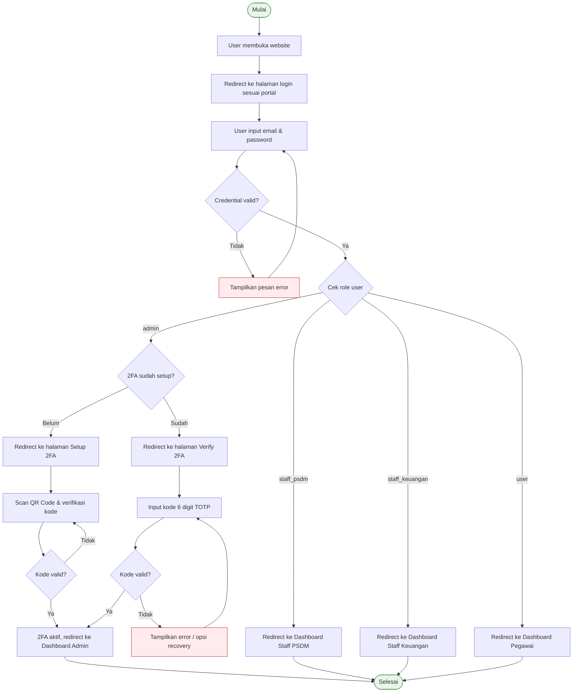

### 6.2 Flowchart Check-In Presensi

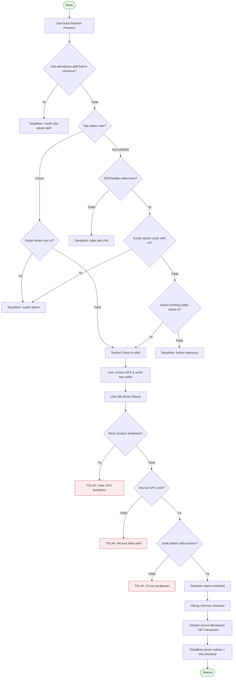

### 6.3 Flowchart Check-Out Presensi

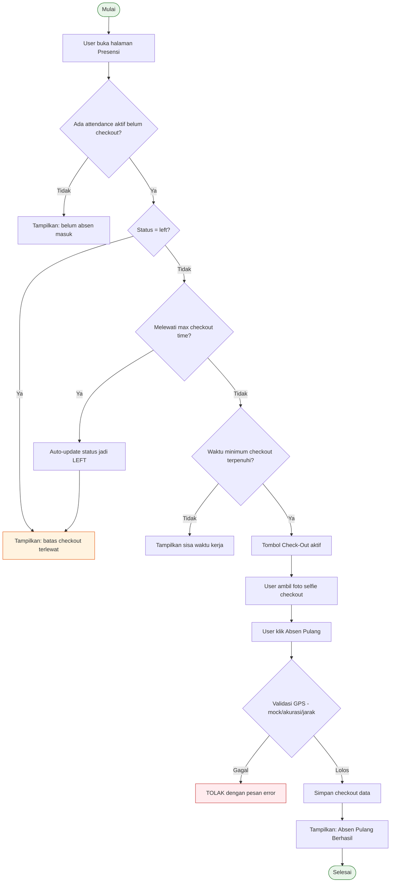

### 6.4 Flowchart Pengajuan Cuti

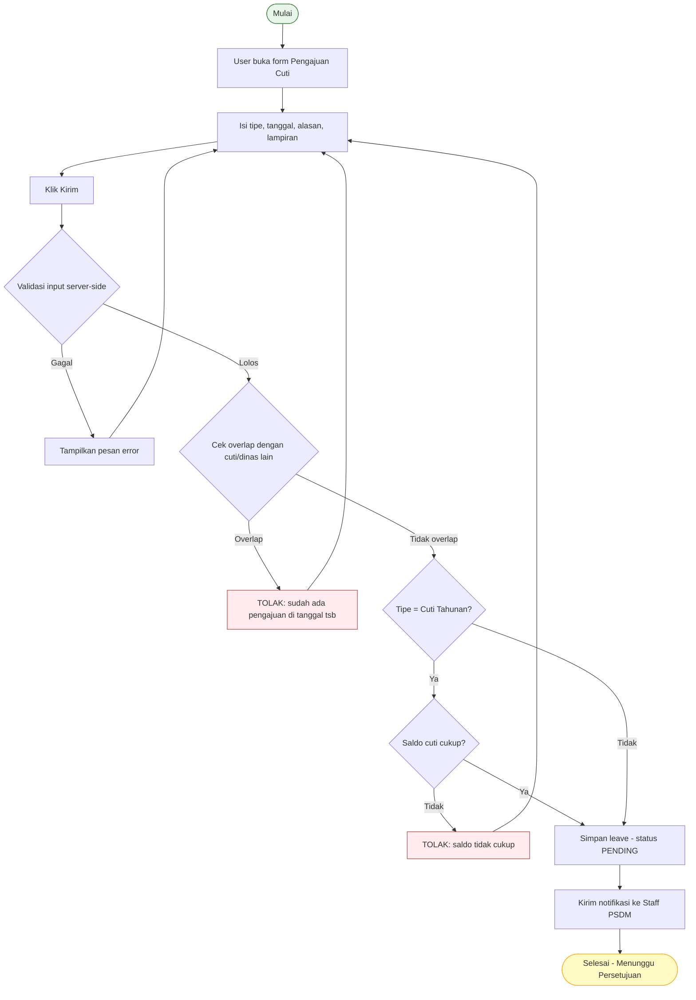

### 6.5 Flowchart Approve/Reject Cuti (Staff PSDM)

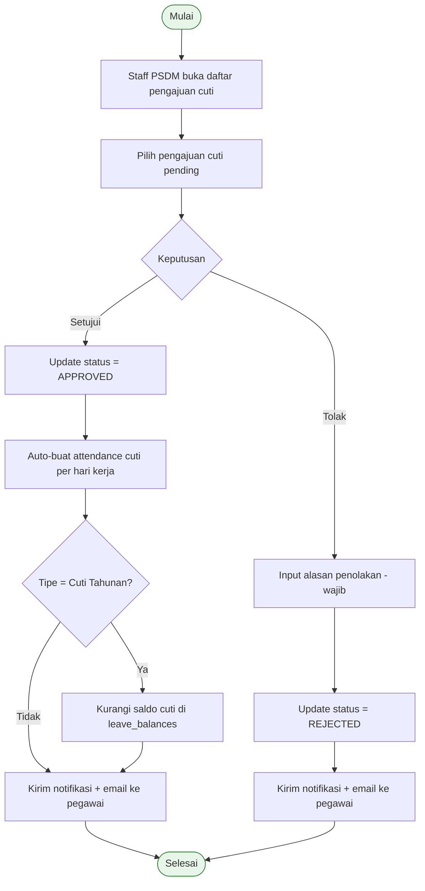

### 6.6 Flowchart Input Gaji Manual

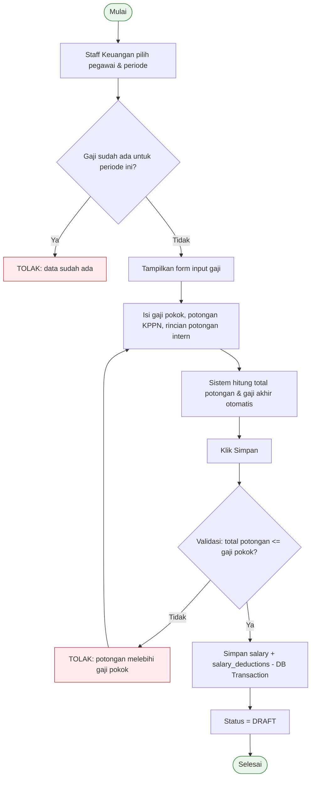

### 6.7 Flowchart Tanda Tangan & Download Slip Gaji PDF

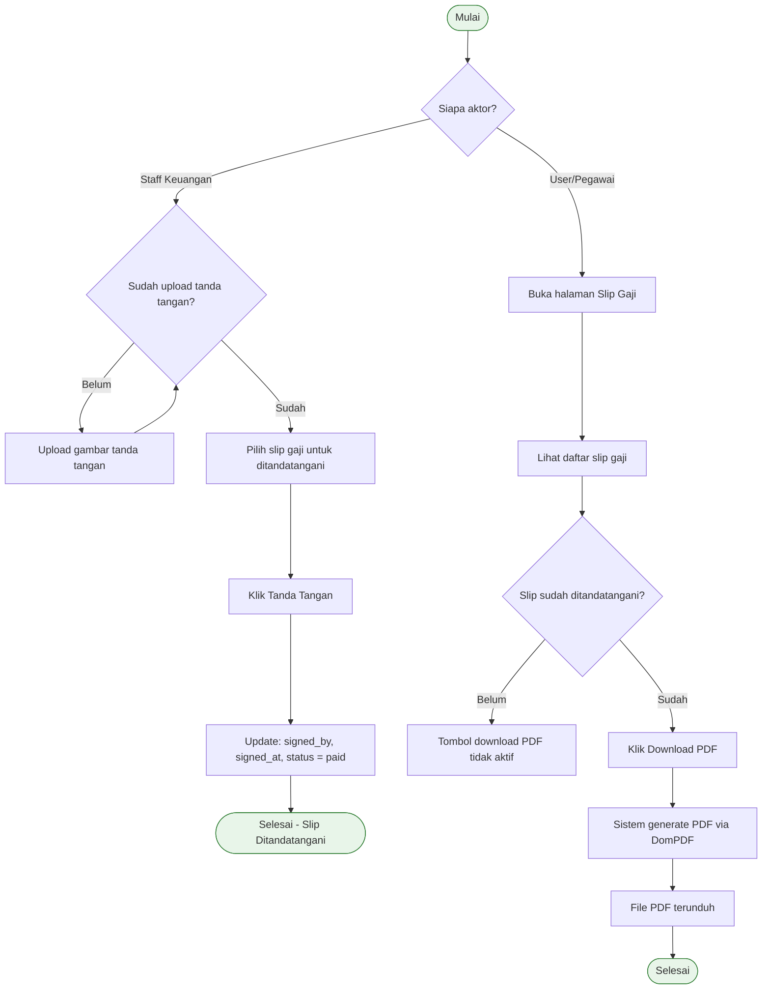

### 6.8 Flowchart Logout

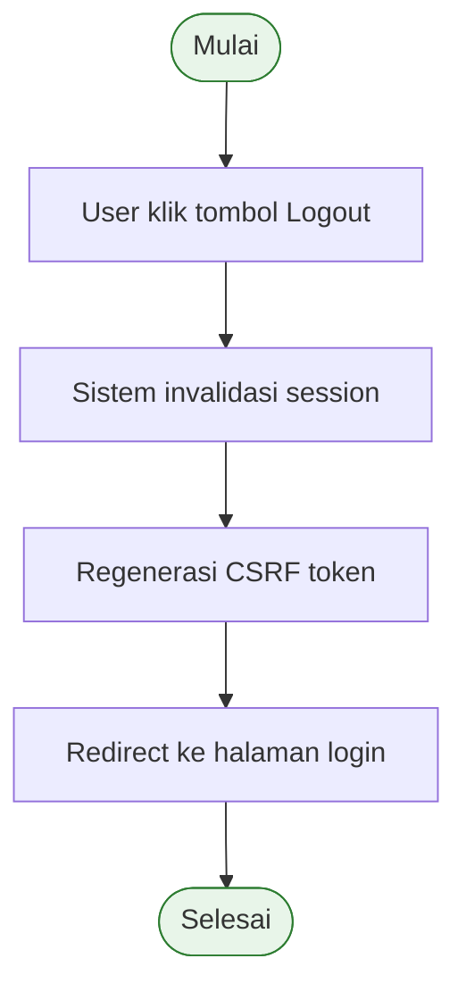

---

## 7. Struktur Database

Sistem ini menggunakan database **MySQL** dengan nama `tvri_absensi`. Terdapat **15 tabel utama** (tidak termasuk tabel bawaan Laravel untuk cache, jobs, dan sessions).

### 7.1 Tabel `users`

| Aspek | Detail |
|-------|--------|
| **Fungsi** | Menyimpan data akun dan biodata seluruh pengguna sistem |
| **Kolom Penting** | `id`, `name`, `email`, `password`, `role` (admin/staff_psdm/staff_keuangan/user), `attendance_type` (normal/shift/umum), `nip` (18 digit), `nik` (16 digit), `npwp`, `jabatan`, `bagian`, `status_pegawai`, `nomor_sk`, `tanggal_sk`, `status_pajak`, `nomor_rekening`, `nama_bank`, `gaji_pokok`, `alamat`, `no_telepon`, `tanggal_lahir`, `jenis_kelamin`, `profile_photo`, `signature`, `status_operasional`, `two_factor_secret`, `two_factor_enabled`, `two_factor_recovery_codes` |
| **Relasi** | One-to-Many → `attendances`, `salaries`, `leaves`, `business_trips`, `notifications`, `leave_balances`, `activity_logs` |

### 7.2 Tabel `attendances`

| Aspek | Detail |
|-------|--------|
| **Fungsi** | Menyimpan record kehadiran harian (check-in, check-out, status) |
| **Kolom Penting** | `id`, `user_id`, `shift_id`, `leave_id`, `business_trip_id`, `attendance_type`, `photo_path`, `check_out_photo_path`, `check_in_time`, `check_out_time`, `min_check_out_time`, `max_check_out_time`, `latitude`, `longitude`, `location_accuracy`, `check_out_latitude`, `check_out_longitude`, `check_out_location_accuracy`, `is_mock_location`, `status` (present/late/cuti/dinas_luar/left/absent), `manual_reason`, `created_by`, `work_date` |
| **Relasi** | Many-to-One → `users`, `shifts`, `leaves`, `business_trips` |

### 7.3 Tabel `shifts`

| Aspek | Detail |
|-------|--------|
| **Fungsi** | Menyimpan definisi shift/jadwal kerja |
| **Kolom Penting** | `id`, `name`, `type` (normal/shift), `start_time`, `end_time`, `tolerance_minutes` |
| **Relasi** | One-to-Many → `attendances`, `shift_logs` |

### 7.4 Tabel `shift_logs`

| Aspek | Detail |
|-------|--------|
| **Fungsi** | Audit trail perubahan konfigurasi shift oleh admin |
| **Kolom Penting** | `id`, `shift_id`, `changed_by`, `field_name`, `old_value`, `new_value` |
| **Relasi** | Many-to-One → `shifts`, `users` |

### 7.5 Tabel `leaves`

| Aspek | Detail |
|-------|--------|
| **Fungsi** | Menyimpan pengajuan cuti/izin pegawai |
| **Kolom Penting** | `id`, `user_id`, `start_date`, `end_date`, `reason`, `attachment`, `type` (cuti_tahunan/sakit/alasan_penting/lainnya), `status` (pending/approved/rejected), `approved_by`, `rejection_reason` |
| **Relasi** | Many-to-One → `users` (pemohon), `users` (penyetuju). One-to-Many → `attendances` |

### 7.6 Tabel `leave_balances`

| Aspek | Detail |
|-------|--------|
| **Fungsi** | Menyimpan saldo kuota cuti tahunan per pegawai per tahun |
| **Kolom Penting** | `id`, `user_id`, `year`, `initial_balance` (default 12), `used`, `remaining`, `notes` |
| **Relasi** | Many-to-One → `users` |

### 7.7 Tabel `business_trips`

| Aspek | Detail |
|-------|--------|
| **Fungsi** | Menyimpan pengajuan perjalanan dinas luar |
| **Kolom Penting** | `id`, `user_id`, `start_date`, `end_date`, `destination`, `purpose`, `attachment`, `status` (pending/approved/rejected), `approved_by`, `rejection_reason` |
| **Relasi** | Many-to-One → `users` (pemohon), `users` (penyetuju). One-to-Many → `attendances` |

### 7.8 Tabel `salaries`

| Aspek | Detail |
|-------|--------|
| **Fungsi** | Menyimpan slip gaji bulanan pegawai |
| **Kolom Penting** | `id`, `user_id`, `month`, `year`, `base_salary`, `potongan_kppn`, `total_potongan_intern`, `deductions`, `final_salary`, `created_by`, `status` (draft/approved/paid), `signed_by`, `signed_at`, `notes` |
| **Relasi** | Many-to-One → `users` (pegawai), `users` (pembuat), `users` (penandatangan). One-to-Many → `salary_deductions` |

### 7.9 Tabel `salary_deductions`

| Aspek | Detail |
|-------|--------|
| **Fungsi** | Menyimpan rincian potongan intern per slip gaji |
| **Kolom Penting** | `id`, `salary_id`, `deduction_type_id`, `amount` |
| **Relasi** | Many-to-One → `salaries`, `deduction_types` |

### 7.10 Tabel `deduction_types`

| Aspek | Detail |
|-------|--------|
| **Fungsi** | Master data jenis-jenis potongan gaji intern |
| **Kolom Penting** | `id`, `name`, `description`, `is_active` |
| **Data Default** | Koperasi, Denda Keterlambatan, Kasbon, BPJS Kesehatan, BPJS Ketenagakerjaan, Lain-lain |
| **Relasi** | One-to-Many → `salary_deductions` |

### 7.11 Tabel `announcements`

| Aspek | Detail |
|-------|--------|
| **Fungsi** | Menyimpan pengumuman dari manajemen |
| **Kolom Penting** | `id`, `title`, `content`, `created_by`, `is_active` |
| **Relasi** | Many-to-One → `users` (pembuat) |

### 7.12 Tabel `notifications`

| Aspek | Detail |
|-------|--------|
| **Fungsi** | Menyimpan notifikasi in-app untuk setiap pengguna |
| **Kolom Penting** | `id`, `user_id`, `type`, `icon`, `color`, `message`, `detail`, `url`, `read_at` |
| **Relasi** | Many-to-One → `users` |

### 7.13 Tabel `activity_logs`

| Aspek | Detail |
|-------|--------|
| **Fungsi** | Audit trail seluruh aksi penting dalam sistem |
| **Kolom Penting** | `id`, `user_id`, `action` (create/update/delete), `model_type`, `model_id`, `description`, `old_values` (JSON), `new_values` (JSON), `ip_address` |
| **Relasi** | Many-to-One → `users`. Polymorphic → model terkait |

### 7.14 Tabel `master_data_types`

| Aspek | Detail |
|-------|--------|
| **Fungsi** | Kategori master data referensi (jabatan, bagian, status) |
| **Kolom Penting** | `id`, `name`, `slug` (auto-generate), `scope` (psdm/keuangan), `description`, `is_active` |
| **Relasi** | One-to-Many → `master_data_values` |

### 7.15 Tabel `master_data_values`

| Aspek | Detail |
|-------|--------|
| **Fungsi** | Nilai-nilai dalam setiap kategori master data |
| **Kolom Penting** | `id`, `master_data_type_id`, `value`, `description`, `is_active`, `sort_order` |
| **Relasi** | Many-to-One → `master_data_types` |

### 7.16 Tabel `settings` (non-migration, key-value store)

| Aspek | Detail |
|-------|--------|
| **Fungsi** | Menyimpan konfigurasi sistem (koordinat kantor, radius geofencing) |
| **Kolom Penting** | `key`, `value` |
| **Data** | `office_latitude`, `office_longitude`, `allowed_radius_meters` |

### Diagram Relasi Antar Tabel

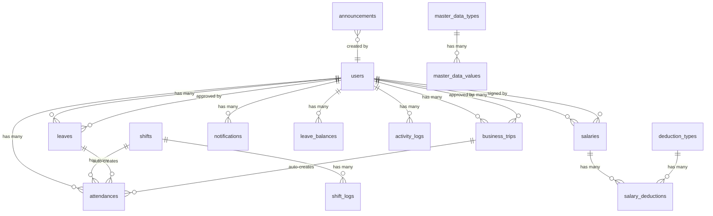

---

## 8. Struktur Folder dan File Penting

```
tvri/absensi/
├── app/
│   ├── Console/                      # Artisan commands (console scheduled tasks)
│   ├── Exports/                      # Kelas export Excel (Maatwebsite)
│   │   ├── AttendanceExport.php      # Export rekap presensi ke Excel
│   │   ├── SalaryExport.php          # Export rekap gaji ke Excel
│   │   └── SalaryTemplateExport.php  # Template Excel untuk import gaji
│   ├── Http/
│   │   ├── Controllers/
│   │   │   ├── AdminController.php          # Logika dashboard admin, settings, shift, staff/admin CRUD, monitor, master data
│   │   │   ├── AttendanceController.php     # Logika check-in/check-out GPS + validasi geofencing
│   │   │   ├── DeductionTypeController.php  # CRUD jenis potongan gaji
│   │   │   ├── ProfileController.php        # Edit profil, foto, hapus akun
│   │   │   ├── StaffKeuanganController.php  # Logika penggajian: input, import, bulk, sign, export
│   │   │   ├── StaffPsdmController.php      # Logika kepegawaian: CRUD user, cuti, dinas, pengumuman, master data
│   │   │   ├── UserController.php           # Dashboard pegawai, rekap, gaji, cuti, dinas luar
│   │   │   └── Auth/                        # Controller autentikasi Laravel Breeze + 2FA
│   │   │       ├── AuthenticatedSessionController.php  # Login multi-portal
│   │   │       ├── RegisteredUserController.php        # Register
│   │   │       └── TwoFactorController.php             # Setup, verify, recovery 2FA
│   │   └── Middleware/
│   │       ├── AdminMiddleware.php           # Proteksi route admin (role=admin)
│   │       ├── StaffPsdmMiddleware.php       # Proteksi route staff PSDM (role=staff_psdm)
│   │       ├── StaffKeuanganMiddleware.php   # Proteksi route staff keuangan (role=staff_keuangan)
│   │       └── TwoFactorMiddleware.php       # Enforce 2FA untuk admin (cek setup & session)
│   ├── Imports/                      # Kelas import Excel
│   │   ├── SalaryImport.php          # Import data gaji dari Excel
│   │   └── UserImport.php            # Import data pegawai dari Excel
│   ├── Mail/                         # Mailable classes (email templates)
│   │   └── LeaveStatusMail.php       # Email notifikasi status cuti (approved/rejected)
│   ├── Models/                       # Eloquent Model (15 model)
│   │   ├── ActivityLog.php           # Model log aktivitas + helper log()
│   │   ├── Announcement.php          # Model pengumuman + scope active()
│   │   ├── Attendance.php            # Model presensi + canCheckOut(), getRemainingMinutes()
│   │   ├── BusinessTrip.php          # Model dinas luar + accessor status_label
│   │   ├── DeductionType.php         # Model jenis potongan gaji
│   │   ├── Leave.php                 # Model cuti + accessor type_label, total_days
│   │   ├── LeaveBalance.php          # Model saldo cuti + getOrCreate(), useLeave()
│   │   ├── MasterDataType.php        # Model kategori master data + auto-slug
│   │   ├── MasterDataValue.php       # Model nilai master data
│   │   ├── Notification.php          # Model notifikasi + scope unread(), markAsRead()
│   │   ├── Salary.php                # Model gaji + accessor month_name, period, isSigned()
│   │   ├── SalaryDeduction.php       # Model rincian potongan gaji
│   │   ├── Shift.php                 # Model shift + getNormalShift(), getCurrentShiftForTime()
│   │   ├── ShiftLog.php              # Model log perubahan shift
│   │   └── User.php                  # Model user + isAdmin(), isShiftAttendance(), hasTwoFactorEnabled()
│   ├── Providers/                    # Service Providers
│   ├── Services/                     # Business Logic Layer
│   │   ├── AttendanceService.php     # Logika inti presensi: canCheckIn, canCheckOut, processCheckIn, processCheckOut, createLeaveAttendances, createBusinessTripAttendances, calculateMinCheckOutTime, calculateMaxCheckOutTime, isLate, calculateWorkDate, getShiftForTime (midnight-crossing aware)
│   │   ├── NotificationService.php   # Kirim notifikasi: cuti, dinas, gaji, pengumuman
│   │   └── SalaryService.php         # Hitung & simpan gaji berdasarkan data kehadiran
│   └── View/                         # View Composers
├── bootstrap/                        # Framework bootstrap files
├── config/                           # Konfigurasi Laravel
│   ├── app.php                       # Konfigurasi aplikasi utama
│   ├── auth.php                      # Guard & provider autentikasi
│   ├── database.php                  # Konfigurasi koneksi database (MySQL)
│   ├── filesystems.php               # Konfigurasi storage (local, public)
│   ├── mail.php                      # Konfigurasi SMTP email (Gmail)
│   └── session.php                   # Konfigurasi session (database driver, 30 menit, expire on close)
├── database/
│   ├── migrations/                   # 43 file migration — evolusi skema database
│   └── seeders/
│       ├── DatabaseSeeder.php        # Seed akun admin + user default
│       ├── DeductionTypeSeeder.php   # Seed 6 jenis potongan bawaan
│       └── MigrateMasterDataSeeder.php  # Migrasi data lama ke master_data
├── lang/                             # Lokalisasi bahasa
├── public/                           # Aset publik (CSS, JS, gambar)
├── resources/
│   ├── css/                          # Stylesheet
│   ├── js/                           # JavaScript
│   └── views/                        # Blade Templates
│       ├── admin/                    # View panel admin (dashboard, settings, monitor, staffs, admins, master-data, activity-logs, leaves)
│       ├── attendance/               # View halaman presensi (GPS + kamera)
│       ├── auth/                     # View login, register, 2FA, forgot password
│       ├── components/               # Blade components reusable
│       ├── dashboard.blade.php       # Dashboard pegawai (home)
│       ├── emails/                   # Template email (cuti status)
│       ├── layouts/                  # Layout utama (sidebar, header, footer)
│       ├── partials/                 # Partial views (notifikasi, theme toggle)
│       ├── profile/                  # View edit profil
│       ├── staff/
│       │   ├── keuangan/             # View panel keuangan (dashboard, salaries, deductions, users)
│       │   └── psdm/                 # View panel PSDM (dashboard, users, announcements, leaves, business-trips, master-data, monitor, manual-attendance)
│       ├── user/                     # View pegawai (rekap, salary, salary-pdf, leaves, business-trips)
│       └── vendor/                   # Vendor blade overrides
├── routes/
│   ├── auth.php                      # Route autentikasi (login, register, 2FA, password reset)
│   ├── console.php                   # Route console (scheduled artisan commands)
│   └── web.php                       # Route utama (216 baris: admin, staff PSDM, staff keuangan, user, profile, attendance, notification, theme)
├── storage/                          # File upload, log, cache
├── .env                              # Environment variables (DB, email, app key)
├── composer.json                     # Dependensi PHP
├── package.json                      # Dependensi frontend (Vite, TailwindCSS, PostCSS)
├── tailwind.config.js                # Konfigurasi TailwindCSS
├── vite.config.js                    # Konfigurasi Vite bundler
└── phpunit.xml                       # Konfigurasi unit testing
```

---

## 9. Penjelasan Backend

### 9.1 Bahasa dan Framework
- **Bahasa**: PHP (8.x)
- **Framework**: Laravel (11.x) dengan arsitektur MVC (Model-View-Controller)
- **Database**: MySQL 8.x (koneksi via `.env`: `tvri_absensi`)
- **Auth Scaffolding**: Laravel Breeze (dikustomisasi dengan multi-portal login dan 2FA)
- **Excel Processing**: Maatwebsite/Laravel-Excel (import dan export `.xlsx/.xls/.csv`)
- **PDF Generation**: Barryvdh/DomPDF (generate slip gaji PDF)
- **Frontend Build**: Vite + TailwindCSS + PostCSS

### 9.2 Cara Routing Bekerja
Routing didefinisikan di dua file utama:

- **`routes/web.php`** (216 baris): Berisi seluruh route web. Diorganisir dalam grup middleware:
  - Route publik: redirect root `/` ke login, theme toggle
  - Route `auth`: profil, attendance, semua fitur user
  - Route `admin` (middleware `admin`): dashboard, settings, shift, CRUD staff/admin, monitor, export, activity log, master data
  - Route `staff/psdm` (middleware `staff.psdm`): dashboard, CRUD user, pengumuman, monitor, master data, cuti, dinas luar, absen manual
  - Route `staff/keuangan` (middleware `staff.keuangan`): dashboard, gaji (input/bulk/import/export/sign), potongan, user profil keuangan

- **`routes/auth.php`** (83 baris): Route autentikasi — login (3 portal), register, password reset, email verification, 2FA (setup/verify/recovery), logout

### 9.3 Controller yang Digunakan (8 Controller Utama)
| Controller | Baris | Fungsi Utama |
|------------|-------|--------------|
| `AdminController` | 590 | Dashboard admin, settings geofencing, CRUD shift, CRUD staff/admin, monitor presensi, activity log, master data |
| `AttendanceController` | 246 | Check-in/check-out GPS, validasi mock location, kalkulasi jarak Haversine |
| `StaffPsdmController` | 1001 | CRUD user, import user Excel, CRUD pengumuman, monitor presensi, master data PSDM, approve/reject cuti & dinas, absen manual |
| `StaffKeuanganController` | 855 | Input gaji (manual/bulk/import), edit/hapus gaji, tanda tangan digital, export, CRUD potongan |
| `UserController` | 417 | Dashboard pegawai, rekap presensi, gaji & PDF, pengajuan cuti & dinas luar |
| `ProfileController` | 106 | Edit profil, foto, hapus akun |
| `DeductionTypeController` | ~80 | CRUD jenis potongan gaji |
| Auth Controllers | ~300 | Login multi-portal, register, password reset, 2FA |

### 9.4 Model yang Digunakan (15 Model)
Seluruh model menggunakan Eloquent ORM dengan fitur: `$fillable` (mass assignment protection), `$casts` (type casting), relasi (`belongsTo`, `hasMany`, `morphTo`), accessor (`getXxxAttribute`), scope (`scopeActive`, `scopePending`, `scopeUnread`), dan helper method.

### 9.5 Proses Validasi Data
Validasi dilakukan di sisi server menggunakan `$request->validate()` pada setiap controller method. Contoh aturan validasi:
- **NIP**: `required|string|size:18|unique:users,nip`
- **NIK**: `required|string|size:16`
- **Password**: `Password::min(8)->mixedCase()->numbers()->symbols()` (min 8 karakter, huruf besar+kecil, angka, simbol) + max 20 karakter
- **Email**: `required|email|unique:users,email`
- **Foto**: `required|image|max:5120` (5MB maks)
- **GPS**: `required|numeric` (latitude, longitude, accuracy)
- **Gaji**: `required|numeric|min:0|max:999999999999`

### 9.6 Proses Penyimpanan ke Database
- Menggunakan **Eloquent ORM** (`Model::create()`, `$model->update()`, `$model->delete()`)
- **DB Transaction** (`DB::transaction()` dengan `lockForUpdate()`) digunakan pada operasi kritis: check-in presensi (race condition prevention), penyimpanan gaji (salary + deductions)
- **Cascade Delete**: Saat user dihapus, semua data terkait (attendance, salary, leave, leave_balance, business_trip, notification) dihapus manual oleh controller

### 9.7 Middleware/Authentication
| Middleware | File | Fungsi |
|------------|------|--------|
| `auth` | Laravel built-in | Memastikan user sudah login |
| `verified` | Laravel built-in | Memastikan email sudah diverifikasi |
| `admin` | `AdminMiddleware.php` | Hanya role=admin yang bisa akses; role lain diredirect ke dashboard masing-masing |
| `staff.psdm` | `StaffPsdmMiddleware.php` | Hanya role=staff_psdm; lainnya abort 403 |
| `staff.keuangan` | `StaffKeuanganMiddleware.php` | Hanya role=staff_keuangan; lainnya abort 403 |
| `2fa` (TwoFactor) | `TwoFactorMiddleware.php` | Untuk admin: enforce 2FA setup → verify setiap sesi login |

### 9.8 Service Layer (Business Logic)
| Service | Fungsi |
|---------|--------|
| `AttendanceService` (649 baris) | Inti logika presensi: penentuan shift, kalkulasi keterlambatan, penanganan midnight-crossing, min/max checkout, work_date calculation, auto-create attendance untuk cuti & dinas |
| `NotificationService` (150 baris) | Factory method untuk membuat notifikasi berdasarkan event (cuti, dinas, gaji, pengumuman) |
| `SalaryService` (~100 baris) | Kalkulasi gaji berdasarkan data kehadiran |

---

## 10. Penjelasan Frontend

### 10.1 Teknologi Frontend
- **Template Engine**: Laravel Blade (`.blade.php`)
- **CSS Framework**: TailwindCSS (konfigurasi di `tailwind.config.js`)
- **Build Tool**: Vite (konfigurasi di `vite.config.js`)
- **JavaScript**: Vanilla JS (Geolocation API, Camera API, form calculation)
- **Icons**: FontAwesome (via CDN)
- **Chart**: Chart.js (digunakan di dashboard Staff PSDM untuk grafik mingguan dan pie chart)
- **Dark Mode**: Toggle tema via session (`/theme/toggle`)

### 10.2 Halaman yang Tersedia

#### Halaman Umum (Semua Role)
| Halaman | File View | Fungsi |
|---------|-----------|--------|
| Login Pegawai | `auth/login.blade.php` | Form login email + password untuk pegawai |
| Login Staff | `auth/login-staff.blade.php` | Form login email + password untuk staff PSDM/Keuangan |
| Login Admin | `auth/login-admin.blade.php` | Form login email + password untuk admin |
| Register | `auth/register.blade.php` | Form pendaftaran akun baru |
| Setup 2FA | `auth/2fa-setup.blade.php` | QR Code untuk scan di Google Authenticator |
| Verify 2FA | `auth/2fa-verify.blade.php` | Input kode 6 digit TOTP |
| Recovery 2FA | `auth/2fa-recovery.blade.php` | Input recovery code |
| Edit Profil | `profile/edit.blade.php` | Form edit nama, email, foto, password |

#### Halaman Pegawai (role=user)
| Halaman | File View | Fungsi |
|---------|-----------|--------|
| Dashboard | `dashboard.blade.php` | Pengumuman, status presensi hari ini, statistik bulanan, info shift, riwayat presensi |
| Presensi | `attendance/index.blade.php` | Peta GPS, kamera selfie, tombol check-in/check-out, info jarak & shift |
| Rekap Presensi | `user/rekap.blade.php` | Tabel kehadiran bulanan, statistik, export Excel |
| Slip Gaji | `user/salary.blade.php` | Daftar slip gaji, detail potongan, tombol download PDF |
| Slip Gaji PDF | `user/salary-pdf.blade.php` | Template PDF slip gaji (DomPDF) |
| Daftar Cuti | `user/leaves/index.blade.php` | Riwayat pengajuan cuti, statistik |
| Ajukan Cuti | `user/leaves/create.blade.php` | Form pengajuan cuti + upload lampiran |
| Daftar Dinas | `user/business-trips/index.blade.php` | Riwayat pengajuan dinas luar |
| Ajukan Dinas | `user/business-trips/create.blade.php` | Form pengajuan dinas luar + upload SPPD |

#### Halaman Admin (role=admin)
| Halaman | File View | Fungsi |
|---------|-----------|--------|
| Dashboard | `admin/dashboard.blade.php` | Tabel presensi hari ini, presensi manual, filter |
| Pengaturan | `admin/settings.blade.php` | Form koordinat kantor, radius, manajemen shift |
| Monitor Presensi | `admin/monitor.blade.php` | Tabel presensi semua pegawai (read-only) |
| Lihat Cuti | `admin/leaves/index.blade.php` | Daftar pengajuan cuti (read-only) |
| Activity Log | `admin/activity-logs.blade.php` | Riwayat aksi sistem |
| CRUD Staff | `admin/staffs/*.blade.php` | Daftar, tambah, edit staff |
| CRUD Admin | `admin/admins/*.blade.php` | Daftar, tambah, edit admin |
| Master Data | `admin/master-data/*.blade.php` | Kategori + nilai master data |

#### Halaman Staff PSDM (role=staff_psdm)
| Halaman | File View | Fungsi |
|---------|-----------|--------|
| Dashboard | `staff/psdm/dashboard.blade.php` | Statistik harian, grafik Chart.js, pengumuman |
| CRUD Pegawai | `staff/psdm/users/*.blade.php` | Daftar, tambah, edit, import pegawai |
| Pengumuman | `staff/psdm/announcements/*.blade.php` | CRUD pengumuman |
| Monitor Presensi | `staff/psdm/monitor.blade.php` | Tabel presensi + filter + hapus + export |
| Manajemen Cuti | `staff/psdm/leaves/index.blade.php` | Daftar cuti + approve/reject |
| Manajemen Dinas | `staff/psdm/business-trips/index.blade.php` | Daftar dinas + approve/reject |
| Master Data | `staff/psdm/master-data/*.blade.php` | Kategori + nilai master data PSDM |
| Absen Manual | `staff/psdm/manual-attendance.blade.php` | Form input presensi manual |

#### Halaman Staff Keuangan (role=staff_keuangan)
| Halaman | File View | Fungsi |
|---------|-----------|--------|
| Dashboard | `staff/keuangan/dashboard.blade.php` | Statistik gaji bulanan |
| Daftar Gaji | `staff/keuangan/salaries/index.blade.php` | Tabel gaji per bulan + filter |
| Input Gaji | `staff/keuangan/salaries/input.blade.php` | Form input gaji per pegawai + potongan dinamis |
| Input Massal | `staff/keuangan/salaries/bulk.blade.php` | Form input gaji banyak pegawai sekaligus |
| Import Excel | `staff/keuangan/salaries/import.blade.php` | Upload file Excel + pilihan overwrite |
| Edit Gaji | `staff/keuangan/salaries/edit.blade.php` | Form edit data gaji |
| Detail Gaji | `staff/keuangan/salaries/detail.blade.php` | Detail slip gaji + tombol tanda tangan |
| Jenis Potongan | `staff/keuangan/deductions/*.blade.php` | CRUD jenis potongan |
| Data Karyawan | `staff/keuangan/users/*.blade.php` | Lihat/edit data keuangan pegawai |

### 10.3 Interaksi User dengan Tampilan
- **Form dengan validasi real-time**: Kalkulasi gaji otomatis (JavaScript) saat mengisi potongan
- **GPS & Kamera**: Menggunakan `navigator.geolocation.getCurrentPosition()` dan `navigator.mediaDevices.getUserMedia()` untuk akses lokasi dan kamera
- **Peta interaktif**: Menampilkan posisi user dan lingkaran radius kantor di halaman presensi
- **Bulk selection**: Checkbox untuk hapus massal pegawai atau tanda tangan massal slip gaji
- **Filter & pagination**: Tabel data mendukung filter (tanggal, status, pencarian) dan pagination server-side
- **Dark mode toggle**: Simpan preferensi tema ke session via AJAX

---

## 11. Alur CRUD

### 11.1 Create (Tambah Data)

**Perspektif User:**
1. User mengklik tombol "Tambah" / "Buat Baru" pada halaman daftar.
2. Sistem menampilkan form kosong dengan field yang diperlukan.
3. User mengisi semua field yang wajib (*required*) dan opsional.
4. User mengklik tombol "Simpan".

**Perspektif Sistem:**
5. Controller menerima request `POST`.
6. Validasi input dilakukan (`$request->validate()`).
7. Jika validasi gagal → redirect balik ke form dengan pesan error dan data lama (`withInput()`).
8. Jika validasi berhasil → data disimpan ke database via `Model::create($data)`.
9. Redirect ke halaman daftar dengan pesan sukses.

**Perspektif Database:**
10. Row baru ditambahkan ke tabel yang sesuai.
11. Kolom `created_at` dan `updated_at` terisi otomatis (timestamps).

### 11.2 Read (Lihat Data)

**Perspektif User:**
1. User membuka halaman daftar (index).
2. Sistem menampilkan tabel data dengan pagination (15-20 per halaman).
3. User dapat menggunakan filter (tanggal, status, pencarian) untuk mempersempit data.
4. User dapat mengklik baris atau tombol "Detail" untuk melihat data lengkap.

**Perspektif Sistem:**
5. Controller membangun query Eloquent dengan filter dari request.
6. Data di-load dengan `->with()` (eager loading) untuk menghindari N+1 query.
7. Hasil di-paginate dan dikirim ke view.

### 11.3 Update (Edit Data)

**Perspektif User:**
1. User mengklik tombol "Edit" pada baris data.
2. Sistem menampilkan form yang sudah terisi data saat ini.
3. User mengubah field yang ingin diperbarui.
4. User mengklik tombol "Simpan Perubahan".

**Perspektif Sistem:**
5. Controller menerima request `PUT/PATCH`.
6. Validasi input dilakukan (termasuk `unique` rule dengan pengecualian ID saat ini).
7. Data diupdate via `$model->update($data)`.
8. Kolom `updated_at` diperbarui otomatis.
9. Redirect ke halaman daftar atau detail dengan pesan sukses.

### 11.4 Delete (Hapus Data)

**Perspektif User:**
1. User mengklik tombol "Hapus" pada baris data.
2. Konfirmasi dialog muncul (JavaScript `confirm()`).
3. Jika dikonfirmasi, request dikirim.

**Perspektif Sistem:**
4. Controller menerima request `DELETE`.
5. Pengecekan keamanan: admin tidak bisa hapus diri sendiri, user hanya bisa hapus miliknya sendiri.
6. Data terkait dibersihkan terlebih dahulu (cascade manual) jika ada.
7. Data dihapus via `$model->delete()`.
8. Redirect ke halaman daftar dengan pesan sukses.

**Perspektif Database:**
9. Row dihapus dari tabel utama.
10. Data terkait di tabel lain juga dihapus (cascade manual).

---

## 12. Alur Login dan Hak Akses

### 12.1 Proses Login

1. **User memasukkan data login**: Email dan password pada form login sesuai portal.
2. **Sistem memvalidasi format input**: Email harus valid, password wajib diisi.
3. **Sistem mengecek credential**: `Auth::attempt(['email' => $email, 'password' => $password])` — password dibandingkan menggunakan bcrypt (12 rounds).
4. **Jika gagal**: Redirect kembali ke form login dengan pesan "Email atau password salah."
5. **Jika berhasil**: Session dibuat, CSRF token di-regenerasi.
6. **Sistem mengecek role user**: Membaca `auth()->user()->role`.
7. **Redirect sesuai role**:
   - `admin` → `/admin` (melalui 2FA terlebih dahulu)
   - `staff_psdm` → `/staff/psdm`
   - `staff_keuangan` → `/staff/keuangan`
   - `user` → `/dashboard` (yang memanggil `UserController@home`)

### 12.2 Proses 2FA (Khusus Admin)

1. Setelah login berhasil, `TwoFactorMiddleware` mengecek setiap request admin.
2. Jika `two_factor_enabled = false` → redirect ke `/two-factor/setup`:
   - Sistem generate secret key TOTP dan QR Code.
   - Admin scan QR Code di aplikasi authenticator.
   - Admin input kode 6 digit → sistem verifikasi → simpan secret + aktifkan 2FA.
   - Generate 8 recovery codes (untuk keadaan darurat kehilangan authenticator).
3. Jika 2FA sudah aktif tapi `session('2fa_verified')` belum ada → redirect ke `/two-factor/verify`:
   - Admin input kode 6 digit TOTP.
   - Sistem verifikasi dengan `TOTP::verify()`.
   - Jika valid → set `session('2fa_verified', true)` → akses dibuka.
   - Jika tidak valid → opsi gunakan recovery code (`/two-factor/recovery`).

### 12.3 Pembatasan Akses Halaman

Setiap grup route dilindungi oleh middleware spesifik:
- **Route `/admin/*`**: `AdminMiddleware` → hanya `role=admin`. Pengguna non-admin yang sudah login diredirect ke dashboard mereka sendiri. Pengguna yang belum login diredirect ke halaman login.
- **Route `/staff/psdm/*`**: `StaffPsdmMiddleware` → hanya `role=staff_psdm`. Lainnya mendapat error `403 Forbidden`.
- **Route `/staff/keuangan/*`**: `StaffKeuanganMiddleware` → hanya `role=staff_keuangan`. Lainnya mendapat error `403 Forbidden`.
- **Route umum** (`/attendance`, `/rekap`, `/cuti`, dll.): Dilindungi middleware `auth` — siapapun yang sudah login bisa akses, tapi controller method mengecek `auth()->user()->id` untuk membatasi data yang ditampilkan hanya milik user bersangkutan.

### 12.4 Proses Logout

1. User mengklik tombol "Logout".
2. Form POST dikirim ke route `logout`.
3. `Auth::guard('web')->logout()` — menghapus data autentikasi dari session.
4. `$request->session()->invalidate()` — session dihancurkan.
5. `$request->session()->regenerateToken()` — CSRF token diganti untuk mencegah CSRF attack.
6. User diredirect ke halaman login.

### 12.5 Keamanan Tambahan
- **Session**: Disimpan di database (`SESSION_DRIVER=database`), timeout 30 menit, expire saat browser ditutup (`SESSION_EXPIRE_ON_CLOSE=true`).
- **Password Hashing**: bcrypt dengan 12 rounds (`BCRYPT_ROUNDS=12`).
- **Password Policy**: Minimal 8 karakter, huruf besar+kecil, angka, simbol.
- **CSRF Protection**: Token otomatis di setiap form via `@csrf` blade directive.

---

## 13. Alur Error dan Validasi

### 13.1 Login Gagal

| Aspek | Detail |
|-------|--------|
| **Penyebab** | Email tidak terdaftar, password salah |
| **Respon Sistem** | Redirect ke form login dengan pesan "Email atau password salah." Input email tetap terisi (remember old input). |

### 13.2 Data Wajib Belum Diisi

| Aspek | Detail |
|-------|--------|
| **Penyebab** | Field dengan rule `required` tidak diisi |
| **Respon Sistem** | Redirect ke form dengan pesan error per field (menggunakan `$errors` Blade variable). Data lama tetap terisi (`withInput()`). |

### 13.3 Format Email Salah

| Aspek | Detail |
|-------|--------|
| **Penyebab** | Input email tidak sesuai format (rule `email`) |
| **Respon Sistem** | Pesan error: "The email field must be a valid email address." |

### 13.4 Data Duplikat (Unique Constraint)

| Aspek | Detail |
|-------|--------|
| **Penyebab** | Email, NIP sudah terdaftar di database |
| **Respon Sistem** | Pesan error: "The email has already been taken." / "The nip has already been taken." |

### 13.5 Gaji untuk Periode Sudah Ada

| Aspek | Detail |
|-------|--------|
| **Penyebab** | Staff Keuangan mencoba input gaji untuk pegawai + bulan/tahun yang sudah ada |
| **Respon Sistem** | Redirect dengan pesan error: "Data gaji untuk karyawan ini pada periode tersebut sudah ada!" |

### 13.6 Total Potongan Melebihi Gaji Pokok

| Aspek | Detail |
|-------|--------|
| **Penyebab** | Saat edit gaji, total potongan (KPPN + Intern) > gaji pokok |
| **Respon Sistem** | Error: "Total potongan (Rp X) tidak boleh lebih besar dari gaji pokok (Rp Y)." |

### 13.7 User Tidak Punya Akses (403 Forbidden)

| Aspek | Detail |
|-------|--------|
| **Penyebab** | User dengan role tertentu mencoba akses route yang bukan haknya (misal: pegawai akses `/admin`) |
| **Respon Sistem** | HTTP 403 — "Akses ditolak. Halaman ini hanya untuk Staff PSDM." (atau sesuai middleware) |

### 13.8 Fake GPS Terdeteksi

| Aspek | Detail |
|-------|--------|
| **Penyebab** | Client mengirim `is_mock_location = true`, atau akurasi GPS = 0m, atau akurasi > 200m |
| **Respon Sistem** | Redirect dengan pesan error: "Terdeteksi penggunaan lokasi palsu (fake GPS). Presensi ditolak!" |

### 13.9 Di Luar Radius Kantor

| Aspek | Detail |
|-------|--------|
| **Penyebab** | Jarak user ke titik kantor (dihitung via rumus Haversine) > radius yang diizinkan |
| **Respon Sistem** | Redirect dengan pesan error: "Anda berada diluar jangkauan kantor! Jarak: X meter." |

### 13.10 Saldo Cuti Tidak Cukup

| Aspek | Detail |
|-------|--------|
| **Penyebab** | User mengajukan cuti tahunan lebih banyak dari sisa saldo |
| **Respon Sistem** | Error: "Saldo cuti tahunan tidak cukup. Sisa: X hari, dibutuhkan: Y hari kerja." |

### 13.11 Overlap Tanggal Cuti/Dinas

| Aspek | Detail |
|-------|--------|
| **Penyebab** | Tanggal pengajuan cuti/dinas bertumpang tindih dengan pengajuan lain yang masih pending/approved |
| **Respon Sistem** | Error: "Sudah ada pengajuan cuti di tanggal tersebut (pending atau disetujui)." |

### 13.12 File Gagal Diupload

| Aspek | Detail |
|-------|--------|
| **Penyebab** | Format file tidak sesuai (bukan jpg/png/pdf/doc), ukuran melebihi batas (>5MB) |
| **Respon Sistem** | Pesan error validasi per field: "The photo must be an image." / "The file may not be greater than 5120 kilobytes." |

### 13.13 Database Gagal (Exception)

| Aspek | Detail |
|-------|--------|
| **Penyebab** | Kegagalan koneksi database, constraint violation, dll. |
| **Respon Sistem** | Transaction di-rollback (`DB::rollBack()`), pesan error ditampilkan: "Terjadi kesalahan: [pesan exception]". Data tidak rusak berkat mekanisme atomic transaction. |

### 13.14 Slip Gaji Belum Ditandatangani (Download PDF Gagal)

| Aspek | Detail |
|-------|--------|
| **Penyebab** | Pegawai mencoba download PDF slip gaji yang belum ditandatangani oleh Staff Keuangan |
| **Respon Sistem** | Redirect dengan error: "Slip gaji belum ditandatangani oleh Staff Keuangan." |

### 13.15 Staff Keuangan Belum Upload Tanda Tangan

| Aspek | Detail |
|-------|--------|
| **Penyebab** | Staff Keuangan mencoba menandatangani slip gaji tanpa upload gambar tanda tangan terlebih dahulu |
| **Respon Sistem** | Error: "Anda belum upload tanda tangan. Silakan upload terlebih dahulu." |

---

## 14. Ringkasan Sistem dalam Bentuk Narasi

Sistem Informasi Presensi dan Penggajian Pegawai Kontrak TVRI adalah sebuah aplikasi web yang dibangun menggunakan framework Laravel (PHP) dengan database MySQL, ditujukan untuk mendigitalkan proses pencatatan kehadiran dan pengelolaan gaji pegawai kontrak di lingkungan TVRI.

Sistem ini lahir dari kebutuhan untuk mengatasi beberapa masalah utama: kecurangan presensi menggunakan GPS palsu (fake GPS / mock location), ketidakefisienan pencatatan kehadiran manual untuk pegawai dengan jadwal kerja yang beragam (normal, shift bergilir, dan bebas 24 jam), serta rumitnya proses rekapitulasi gaji bulanan yang melibatkan berbagai jenis potongan.

Aplikasi ini melayani empat kategori pengguna. **Pegawai Kontrak** (role `user`) menggunakan smartphone atau browser untuk melakukan absensi masuk dan pulang berbasis lokasi GPS dengan bukti foto selfie real-time. Sistem secara otomatis mendeteksi apakah pegawai benar-benar berada dalam radius kantor yang telah ditentukan, serta memeriksa kemungkinan penggunaan GPS palsu melalui beberapa lapisan validasi: deteksi flag mock location dari browser, pengecekan akurasi GPS (menolak akurasi 0 meter atau di atas 200 meter), dan perhitungan jarak menggunakan rumus Haversine.

Keunikan sistem ini terletak pada kemampuannya mengakomodasi tiga tipe jadwal kehadiran. Tipe **Normal** untuk staf dengan jam kantor tetap, tipe **Shift** untuk petugas keamanan dan OB yang bekerja bergilir (termasuk shift yang melewati tengah malam), dan tipe **Umum** untuk pegawai yang bebas absen 24 jam tanpa batasan waktu masuk. Untuk setiap check-in, sistem menghitung waktu minimum checkout (8 jam kerja) dan waktu maksimum checkout (akhir shift + 3 jam), di mana jika melewati batas maksimum, status otomatis berubah menjadi "Meninggalkan Kantor".

Pegawai juga dapat mengajukan cuti dan perjalanan dinas luar melalui sistem. Pengajuan dilengkapi dengan validasi otomatis: pengecekan overlap tanggal dengan pengajuan lain, validasi saldo cuti tahunan (default 12 hari per tahun), dan dukungan upload lampiran dokumen. Saat **Staff PSDM** menyetujui pengajuan, sistem secara otomatis membuat record kehadiran untuk setiap hari kerja dalam rentang cuti/dinas, sehingga rekap bulanan tetap lengkap tanpa perlu input manual.

**Staff Keuangan** mengelola seluruh aspek penggajian. Mereka dapat menginput gaji secara manual per pegawai dengan rincian potongan yang dinamis (Koperasi, BPJS Kesehatan, BPJS Ketenagakerjaan, Kasbon, dll.), melakukan input massal untuk banyak pegawai sekaligus, atau mengimport data dari file Excel menggunakan template yang disediakan. Setelah data gaji siap, Staff Keuangan menandatangani slip gaji secara digital menggunakan gambar tanda tangan yang telah diupload sebelumnya. Hanya slip yang sudah ditandatangani yang dapat diunduh oleh pegawai dalam format PDF.

**Administrator** bertanggung jawab atas konfigurasi teknis sistem: mengatur koordinat GPS pusat kantor dan radius geofencing, mengelola jadwal shift kerja beserta toleransi keterlambatan, serta mengelola akun staff dan admin lain. Keamanan akun admin diperkuat dengan kewajiban Two-Factor Authentication (2FA) berbasis TOTP — admin harus memindai QR Code di aplikasi authenticator dan memasukkan kode 6 digit setiap kali login.

Seluruh aktivitas penting dalam sistem dicatat dalam Activity Log untuk kebutuhan audit, dan sistem notifikasi in-app memastikan setiap pemangku kepentingan mendapatkan informasi terkini tentang pengajuan cuti baru, persetujuan/penolakan, ketersediaan slip gaji, dan pengumuman penting. Notifikasi penting juga dikirim melalui email (menggunakan SMTP Gmail) untuk memastikan penyampaian yang handal.

---

## 15. Kesimpulan Sistem

### Fungsi Utama Website
Sistem ini berfungsi sebagai platform terpadu untuk mengelola presensi berbasis GPS, pengajuan cuti/dinas, dan penggajian pegawai kontrak TVRI secara digital, transparan, dan aman.

### Kelebihan Sistem
1. **Anti-Kecurangan GPS Multi-Layer**: Deteksi mock location + validasi akurasi GPS + perhitungan jarak Haversine + foto selfie sebagai bukti.
2. **Fleksibilitas Jadwal Kerja**: Mendukung 3 tipe kehadiran (Normal, Shift, Umum) termasuk shift lintas tengah malam.
3. **Otomasi Proses**: Auto-create attendance saat cuti/dinas disetujui, auto-calculate saldo cuti, auto-detect status keterlambatan.
4. **Keamanan Berlapis**: 2FA wajib untuk admin, middleware per role, bcrypt 12 rounds, session timeout 30 menit, CSRF protection.
5. **Proteksi Race Condition**: DB Transaction + `lockForUpdate()` pada proses check-in mencegah duplikasi data saat request bersamaan.
6. **Integrasi Excel**: Import/export data pegawai dan gaji via Excel untuk kompatibilitas dengan workflow yang sudah ada.
7. **Slip Gaji Digital**: Tanda tangan digital + download PDF mengurangi penggunaan kertas.
8. **Audit Trail**: Activity Log mencatat siapa mengubah apa, kapan, dari nilai berapa ke berapa.
9. **Notifikasi Multi-Channel**: In-app notification + email untuk memastikan informasi sampai ke penerima.

### Alur Utama Sistem
1. Pegawai login → buka halaman presensi → izinkan GPS & kamera → absen masuk (validasi lokasi + foto) → bekerja selama 8 jam → absen pulang (validasi lokasi + foto).
2. Pegawai ajukan cuti → Staff PSDM approve → attendance otomatis terisi → saldo cuti berkurang.
3. Staff Keuangan input gaji + potongan → tanda tangan digital → pegawai download slip PDF.

### Fitur Paling Penting
1. **Presensi GPS + Deteksi Fake GPS** (fitur inti pembeda)
2. **Manajemen 3 Tipe Shift** (termasuk midnight-crossing)
3. **Otomasi Attendance saat Cuti/Dinas** (mengurangi beban admin)
4. **Penggajian dengan Potongan Dinamis + Tanda Tangan Digital** (end-to-end payroll)
5. **Two-Factor Authentication untuk Admin** (keamanan tingkat tinggi)

### Saran Pengembangan
1. **Aplikasi Mobile Native**: Membangun aplikasi Android/iOS menggunakan Flutter atau React Native untuk pengalaman pengguna yang lebih baik dan akses hardware yang lebih mendalam (accelerometer, gyroscope untuk deteksi fake GPS tambahan).
2. **Dashboard Analitik Lanjutan**: Menambahkan grafik tren kehadiran per departemen, prediksi kebutuhan SDM berdasarkan data historis.
3. **Integrasi API BPJS & Perbankan**: Otomasi transfer gaji ke rekening pegawai dan pelaporan BPJS.
4. **Fitur Lembur (Overtime)**: Menambahkan kalkulasi lembur berdasarkan checkout yang melebihi jam shift.
5. **Progressive Web App (PWA)**: Mengubah web menjadi PWA agar bisa di-install di smartphone tanpa perlu app store.
6. **Backup & Recovery Otomatis**: Menjadwalkan backup database otomatis dan skenario disaster recovery.
7. **Role-Based Dashboard Customization**: Memungkinkan admin mengkustomisasi widget dashboard per role.
8. **WebSocket untuk Notifikasi Real-Time**: Mengganti polling dengan WebSocket (Laravel Reverb/Pusher) agar notifikasi muncul secara instan tanpa refresh halaman.

---

## 16. Use Case Diagram

Use Case Diagram menggambarkan interaksi antara setiap aktor (pengguna) dengan sistem. Diagram ini menunjukkan fungsi-fungsi apa saja yang dapat diakses oleh masing-masing aktor.

### 16.1 Use Case Diagram — Keseluruhan Sistem

Diagram berikut menggambarkan gambaran besar seluruh use case yang tersedia dalam sistem beserta aktor yang terlibat.

```mermaid
flowchart LR
    subgraph Aktor
        U(["👤 Pegawai Kontrak"])
        SP(["👔 Staff PSDM"])
        SK(["💰 Staff Keuangan"])
        A(["🔐 Admin"])
    end

    subgraph "Sistem Presensi & Penggajian TVRI"
        subgraph "Autentikasi"
            UC1["Login Multi-Portal"]
            UC2["Setup & Verify 2FA"]
            UC3["Logout"]
            UC4["Edit Profil"]
        end

        subgraph "Presensi"
            UC5["Check-In GPS + Foto"]
            UC6["Check-Out GPS + Foto"]
            UC7["Lihat Rekap Presensi"]
            UC8["Monitor Presensi"]
            UC9["Input Absen Manual"]
            UC10["Ekspor Rekap Presensi"]
        end

        subgraph "Cuti & Dinas"
            UC11["Ajukan Cuti"]
            UC12["Ajukan Dinas Luar"]
            UC13["Approve/Reject Cuti"]
            UC14["Approve/Reject Dinas"]
            UC15["Batalkan Pengajuan"]
        end

        subgraph "Penggajian"
            UC16["Input Gaji Manual"]
            UC17["Input Gaji Massal"]
            UC18["Import Gaji Excel"]
            UC19["Tanda Tangan Slip"]
            UC20["Lihat Slip Gaji"]
            UC21["Download PDF Slip"]
            UC22["Ekspor Rekap Gaji"]
        end

        subgraph "Manajemen"
            UC23["Kelola Data Pegawai"]
            UC24["Import Pegawai Excel"]
            UC25["Kelola Pengumuman"]
            UC26["Kelola Master Data"]
            UC27["Kelola Shift"]
            UC28["Kelola Akun Staff/Admin"]
            UC29["Atur Lokasi Geofencing"]
            UC30["Lihat Activity Log"]
            UC31["Kelola Jenis Potongan"]
            UC32["Kelola Saldo Cuti"]
        end

        UC33["Terima Notifikasi"]
    end

    U --> UC1
    U --> UC3
    U --> UC4
    U --> UC5
    U --> UC6
    U --> UC7
    U --> UC11
    U --> UC12
    U --> UC15
    U --> UC20
    U --> UC21
    U --> UC33

    SP --> UC1
    SP --> UC3
    SP --> UC4
    SP --> UC8
    SP --> UC9
    SP --> UC10
    SP --> UC13
    SP --> UC14
    SP --> UC23
    SP --> UC24
    SP --> UC25
    SP --> UC26
    SP --> UC32
    SP --> UC33

    SK --> UC1
    SK --> UC3
    SK --> UC4
    SK --> UC16
    SK --> UC17
    SK --> UC18
    SK --> UC19
    SK --> UC22
    SK --> UC31
    SK --> UC33

    A --> UC1
    A --> UC2
    A --> UC3
    A --> UC4
    A --> UC8
    A --> UC9
    A --> UC27
    A --> UC28
    A --> UC29
    A --> UC26
    A --> UC30
    A --> UC10

    style U fill:#E3F2FD,stroke:#1565C0,color:#000
    style SP fill:#E8F5E9,stroke:#2E7D32,color:#000
    style SK fill:#FFF3E0,stroke:#E65100,color:#000
    style A fill:#FCE4EC,stroke:#C62828,color:#000
```

### 16.2 Use Case Diagram — Aktor: Pegawai Kontrak (User)

Diagram berikut merinci seluruh use case yang dimiliki oleh aktor Pegawai Kontrak.

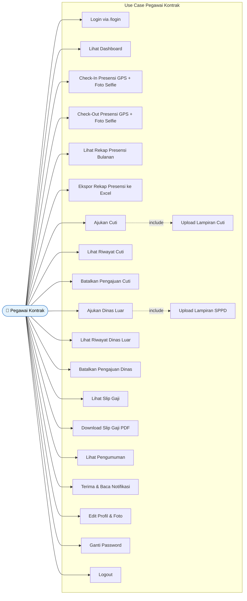

**Penjelasan Use Case Pegawai Kontrak:**

| No | Use Case | Deskripsi |
|----|----------|----------|
| 1 | Login via /login | Pegawai memasukkan email dan password pada halaman login pegawai |
| 2 | Lihat Dashboard | Melihat ringkasan: pengumuman aktif, status presensi hari ini, statistik bulanan, info shift |
| 3 | Check-In Presensi GPS + Foto Selfie | Melakukan absen masuk dengan validasi lokasi GPS, deteksi fake GPS, dan bukti foto selfie |
| 4 | Check-Out Presensi GPS + Foto Selfie | Melakukan absen pulang setelah minimum 8 jam kerja dengan validasi serupa |
| 5 | Lihat Rekap Presensi Bulanan | Melihat tabel riwayat kehadiran per bulan beserta statistik (hadir, terlambat, cuti) |
| 6 | Ekspor Rekap Presensi ke Excel | Mengunduh rekap presensi dalam format file Excel (.xlsx) |
| 7 | Ajukan Cuti | Mengisi form pengajuan cuti (tipe, tanggal, alasan) dengan validasi saldo dan overlap |
| 8 | Upload Lampiran Cuti | Menyertakan dokumen pendukung (surat dokter, dll.) saat mengajukan cuti — *include* dari Ajukan Cuti |
| 9 | Lihat Riwayat Cuti | Melihat daftar pengajuan cuti beserta statusnya (Pending/Approved/Rejected) |
| 10 | Batalkan Pengajuan Cuti | Membatalkan pengajuan cuti yang masih berstatus Pending |
| 11 | Ajukan Dinas Luar | Mengisi form pengajuan perjalanan dinas (tujuan, tanggal, maksud) |
| 12 | Upload Lampiran SPPD | Menyertakan Surat Perintah Perjalanan Dinas — *include* dari Ajukan Dinas Luar |
| 13 | Lihat Riwayat Dinas Luar | Melihat daftar pengajuan dinas luar beserta statusnya |
| 14 | Batalkan Pengajuan Dinas | Membatalkan pengajuan dinas yang masih berstatus Pending |
| 15 | Lihat Slip Gaji | Melihat daftar slip gaji bulanan beserta rincian potongan |
| 16 | Download Slip Gaji PDF | Mengunduh slip gaji dalam format PDF (hanya yang sudah ditandatangani Staff Keuangan) |
| 17 | Lihat Pengumuman | Membaca pengumuman aktif dari manajemen di halaman dashboard |
| 18 | Terima & Baca Notifikasi | Menerima notifikasi in-app (cuti diproses, gaji tersedia, dll.) dan menandai sebagai dibaca |
| 19 | Edit Profil & Foto | Mengubah nama, email, dan foto profil |
| 20 | Ganti Password | Mengubah password akun |
| 21 | Logout | Keluar dari sistem |

### 16.3 Use Case Diagram — Aktor: Staff PSDM

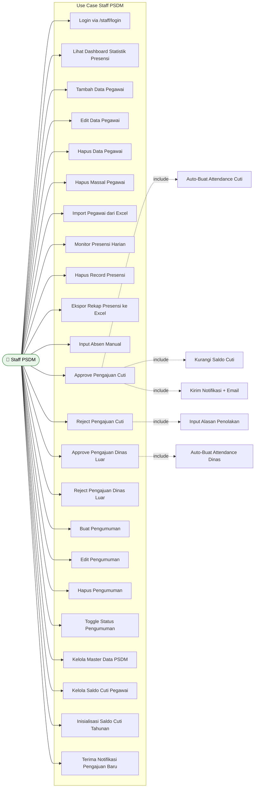

**Penjelasan Use Case Staff PSDM:**

| No | Use Case | Deskripsi |
|----|----------|----------|
| 1 | Login via /staff/login | Staff PSDM login melalui portal khusus staff |
| 2 | Lihat Dashboard Statistik Presensi | Melihat statistik harian (total hadir, terlambat, tepat waktu), grafik mingguan (Chart.js), pie chart bulanan |
| 3 | Tambah Data Pegawai | Membuat akun pegawai baru dengan biodata lengkap dan konfigurasi tipe absensi |
| 4 | Edit Data Pegawai | Mengubah biodata dan konfigurasi absensi pegawai yang sudah ada |
| 5 | Hapus Data Pegawai | Menghapus akun pegawai beserta seluruh data terkait (cascade delete) |
| 6 | Hapus Massal Pegawai | Menghapus beberapa pegawai sekaligus dengan checkbox selection |
| 7 | Import Pegawai dari Excel | Mengunggah file Excel (.xlsx/.xls/.csv) berisi data pegawai untuk input massal |
| 8 | Monitor Presensi Harian | Memantau kehadiran seluruh pegawai dengan filter tanggal, status, dan pencarian |
| 9 | Hapus Record Presensi | Menghapus record presensi yang salah atau duplikat |
| 10 | Ekspor Rekap Presensi ke Excel | Mengunduh data presensi dalam format Excel per hari, bulan, atau semua data |
| 11 | Input Absen Manual | Menginput presensi secara manual untuk pegawai yang berhalangan absen via GPS |
| 12 | Approve Pengajuan Cuti | Menyetujui pengajuan cuti → otomatis membuat record attendance cuti, mengurangi saldo, dan mengirim notifikasi + email |
| 13 | Reject Pengajuan Cuti | Menolak pengajuan cuti dengan wajib mengisi alasan penolakan |
| 14 | Approve Pengajuan Dinas Luar | Menyetujui pengajuan dinas → otomatis membuat record attendance dinas luar |
| 15 | Reject Pengajuan Dinas Luar | Menolak pengajuan dinas luar dengan alasan |
| 16–19 | CRUD Pengumuman | Membuat, mengedit, menghapus, dan mengaktifkan/menonaktifkan pengumuman |
| 20 | Kelola Master Data PSDM | Mengelola kategori dan nilai data referensi (jabatan, bagian, status pegawai) |
| 21 | Kelola Saldo Cuti Pegawai | Melihat dan mengedit saldo cuti tahunan per pegawai |
| 22 | Inisialisasi Saldo Cuti Tahunan | Membuat saldo cuti awal (default 12 hari) untuk seluruh pegawai di tahun baru |
| 23 | Terima Notifikasi Pengajuan Baru | Menerima notifikasi otomatis saat ada pengajuan cuti atau dinas baru dari pegawai |

### 16.4 Use Case Diagram — Aktor: Staff Keuangan

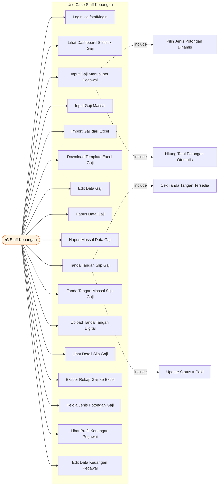

**Penjelasan Use Case Staff Keuangan:**

| No | Use Case | Deskripsi |
|----|----------|----------|
| 1 | Login via /staff/login | Staff Keuangan login melalui portal khusus staff |
| 2 | Lihat Dashboard Statistik Gaji | Melihat total pegawai, gaji yang sudah/belum diproses bulan ini, total pengeluaran gaji |
| 3 | Input Gaji Manual per Pegawai | Mengisi gaji pokok, potongan KPPN, dan rincian potongan intern dinamis (Koperasi, BPJS, Kasbon, dll.) |
| 4 | Input Gaji Massal | Menginput gaji untuk banyak pegawai sekaligus dalam satu form |
| 5 | Import Gaji dari Excel | Mengunggah file Excel berisi data gaji sesuai template untuk import otomatis |
| 6 | Download Template Excel Gaji | Mengunduh template Excel kosong yang sudah berisi format kolom yang benar |
| 7 | Edit Data Gaji | Mengubah data gaji yang sudah diinput (gaji pokok, potongan, catatan) |
| 8 | Hapus Data Gaji | Menghapus record gaji beserta rincian potongan dan notifikasi terkait |
| 9 | Hapus Massal Data Gaji | Menghapus beberapa record gaji sekaligus |
| 10 | Tanda Tangan Slip Gaji | Menandatangani slip gaji secara digital (individual) — mengubah status ke Paid |
| 11 | Tanda Tangan Massal Slip Gaji | Menandatangani beberapa slip gaji sekaligus |
| 12 | Upload Tanda Tangan Digital | Mengunggah gambar tanda tangan (prerequisite untuk menandatangani slip) |
| 13 | Lihat Detail Slip Gaji | Melihat rincian lengkap slip gaji per pegawai |
| 14 | Ekspor Rekap Gaji ke Excel | Mengunduh rekap gaji bulanan dalam format Excel |
| 15 | Kelola Jenis Potongan Gaji | CRUD jenis potongan intern (Koperasi, BPJS, Kasbon, dll.) |
| 16 | Lihat Profil Keuangan Pegawai | Melihat data keuangan pegawai (rekening, NPWP, status pajak) |
| 17 | Edit Data Keuangan Pegawai | Mengubah data keuangan pegawai (nomor rekening, bank, NPWP, dll.) |

### 16.5 Use Case Diagram — Aktor: Admin

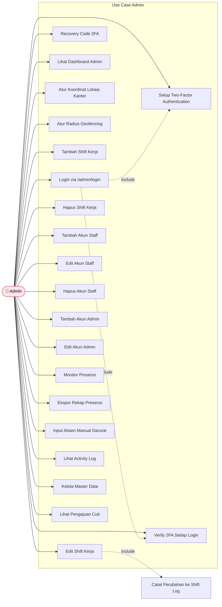

**Penjelasan Use Case Admin:**

| No | Use Case | Deskripsi |
|----|----------|----------|
| 1 | Login via /admin/login | Admin login melalui portal khusus admin |
| 2 | Setup Two-Factor Authentication | Mengaktifkan 2FA dengan scan QR Code di aplikasi authenticator (wajib saat pertama kali) |
| 3 | Verify 2FA Setiap Login | Memasukkan kode 6 digit TOTP setiap kali login |
| 4 | Recovery Code 2FA | Menggunakan recovery code jika kehilangan akses authenticator |
| 5 | Lihat Dashboard Admin | Melihat tabel presensi hari ini dan form presensi manual |
| 6 | Atur Koordinat Lokasi Kantor | Mengatur latitude dan longitude titik pusat kantor untuk geofencing |
| 7 | Atur Radius Geofencing | Mengatur radius (dalam meter) area yang diizinkan untuk presensi |
| 8–10 | CRUD Shift Kerja | Menambah, mengedit, menghapus shift kerja (jam mulai, jam akhir, toleransi terlambat) |
| 11–13 | CRUD Akun Staff | Menambah, mengedit, menghapus akun Staff PSDM dan Staff Keuangan |
| 14–15 | CRUD Akun Admin | Menambah dan mengedit akun admin lain |
| 16 | Monitor Presensi | Melihat data presensi seluruh pegawai (read-only) |
| 17 | Ekspor Rekap Presensi | Mengunduh rekap presensi dalam format Excel |
| 18 | Input Absen Manual Darurat | Menginput presensi manual untuk situasi darurat |
| 19 | Lihat Activity Log | Melihat riwayat seluruh aksi penting dalam sistem (audit trail) |
| 20 | Kelola Master Data | Mengelola data referensi dropdown (jabatan, bagian, status) |
| 21 | Lihat Pengajuan Cuti | Melihat daftar pengajuan cuti (read-only, tanpa approve/reject) |

---

## 17. Activity Diagram

Activity Diagram digunakan untuk menggambarkan alur proses (workflow) dalam sistem secara detail. Diagram ini menunjukkan urutan aktivitas yang dilakukan oleh pengguna dan sistem, termasuk percabangan keputusan (*decision*), aksi paralel (*fork/join*), dan jalur alternatif.

### 17.1 Activity Diagram — Proses Check-In Presensi

Diagram ini menggambarkan alur lengkap proses absen masuk dari perspektif Pegawai (swimlane kiri) dan Sistem (swimlane kanan).

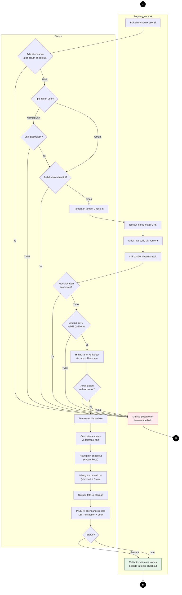

**Penjelasan langkah-langkah:**
1. Pegawai membuka halaman Presensi di browser.
2. Sistem mengecek apakah ada attendance yang masih aktif (belum checkout). Jika ada → error.
3. Sistem mengecek tipe absen pegawai (Normal/Shift/Umum).
4. Untuk tipe Normal/Shift: sistem mencari shift yang berlaku berdasarkan waktu saat ini. Jika tidak ditemukan → error.
5. Sistem mengecek apakah pegawai sudah absen hari ini. Jika sudah → error.
6. Tombol Check-In ditampilkan, pegawai mengizinkan GPS dan mengambil foto selfie.
7. Pegawai menekan tombol Absen Masuk, data dikirim ke server.
8. Server memvalidasi: mock location, akurasi GPS, jarak ke kantor.
9. Jika semua validasi lolos: tentukan shift, cek keterlambatan, hitung batas checkout.
10. Foto disimpan ke storage, record attendance diinsert menggunakan DB Transaction + Lock.
11. Sistem menampilkan konfirmasi sukses beserta info jam minimum checkout.

### 17.2 Activity Diagram — Proses Check-Out Presensi

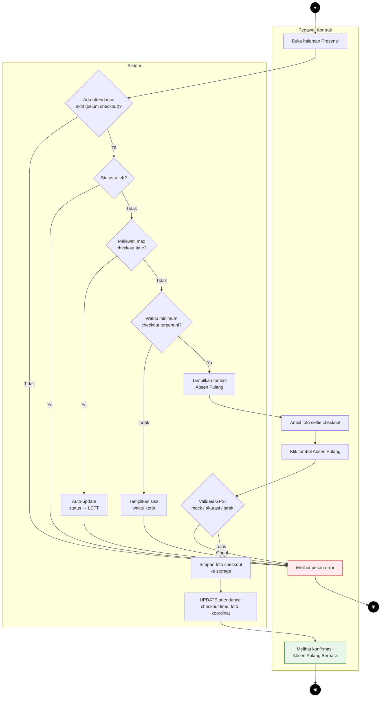

**Penjelasan langkah-langkah:**
1. Pegawai membuka halaman Presensi.
2. Sistem mencari attendance aktif yang belum checkout. Jika tidak ada → error (belum absen masuk).
3. Cek apakah status sudah berubah menjadi `left` (melewati batas). Jika ya → error.
4. Cek apakah sudah melewati max checkout time. Jika ya → auto-update status ke `left`.
5. Cek apakah waktu minimum kerja (8 jam) sudah terpenuhi. Jika belum → tampilkan sisa waktu.
6. Tombol Absen Pulang aktif, pegawai ambil foto dan klik tombol.
7. Server memvalidasi GPS (mock, akurasi, jarak).
8. Jika lolos: simpan foto, update record attendance dengan checkout time dan koordinat.

### 17.3 Activity Diagram — Proses Pengajuan dan Persetujuan Cuti

Diagram ini menggambarkan alur lengkap dari pengajuan cuti oleh Pegawai hingga diproses oleh Staff PSDM.

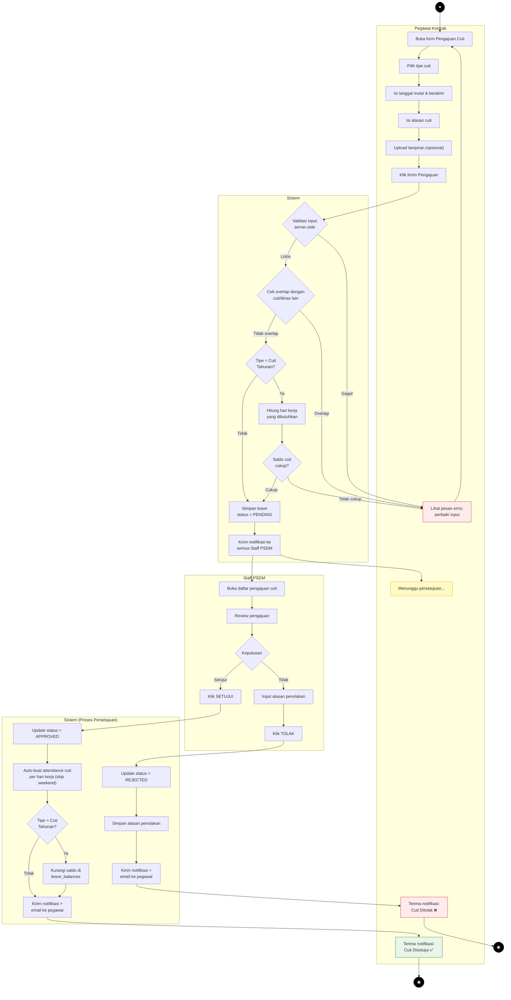

**Penjelasan langkah-langkah:**
1. Pegawai membuka form pengajuan cuti dan mengisi data (tipe, tanggal, alasan, lampiran).
2. Sistem memvalidasi input, mengecek overlap tanggal, dan (jika cuti tahunan) mengecek saldo.
3. Jika semua valid, pengajuan disimpan dengan status `PENDING` dan notifikasi dikirim ke Staff PSDM.
4. Staff PSDM membuka daftar pengajuan, me-review, dan memutuskan approve atau reject.
5. Jika **disetujui**: sistem auto-create attendance cuti per hari kerja, kurangi saldo cuti (jika tahunan), dan kirim notifikasi + email.
6. Jika **ditolak**: staff wajib input alasan, sistem simpan dan kirim notifikasi + email.

### 17.4 Activity Diagram — Proses Input dan Penandatanganan Gaji

Diagram ini menggambarkan alur lengkap proses penggajian dari input oleh Staff Keuangan hingga download PDF oleh Pegawai.

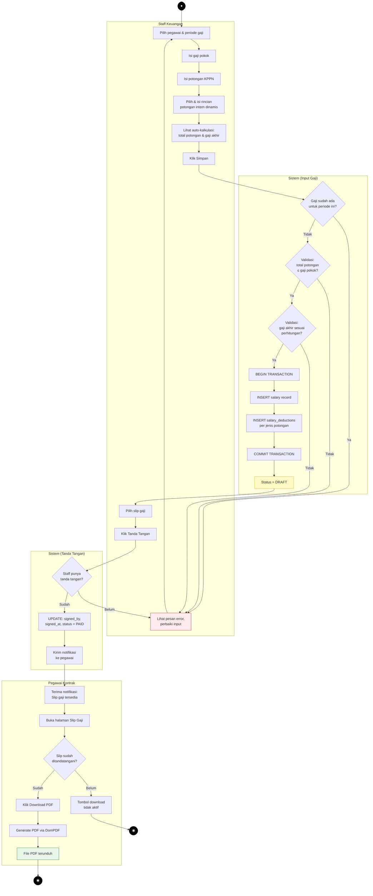

**Penjelasan langkah-langkah:**
1. Staff Keuangan memilih pegawai dan periode (bulan/tahun).
2. Mengisi gaji pokok, potongan KPPN, dan rincian potongan intern (dinamis dari master data).
3. Sistem auto-calculate total potongan dan gaji akhir.
4. Saat klik Simpan: validasi duplikat, total potongan ≤ gaji pokok, dan gaji akhir sesuai perhitungan.
5. Data disimpan menggunakan DB Transaction (salary + salary_deductions), status awal = DRAFT.
6. Staff Keuangan menandatangani slip (harus sudah upload gambar tanda tangan).
7. Pegawai menerima notifikasi, membuka halaman slip gaji.
8. Hanya slip yang sudah ditandatangani yang bisa diunduh dalam format PDF.

### 17.5 Activity Diagram — Proses Login dengan 2FA (Admin)

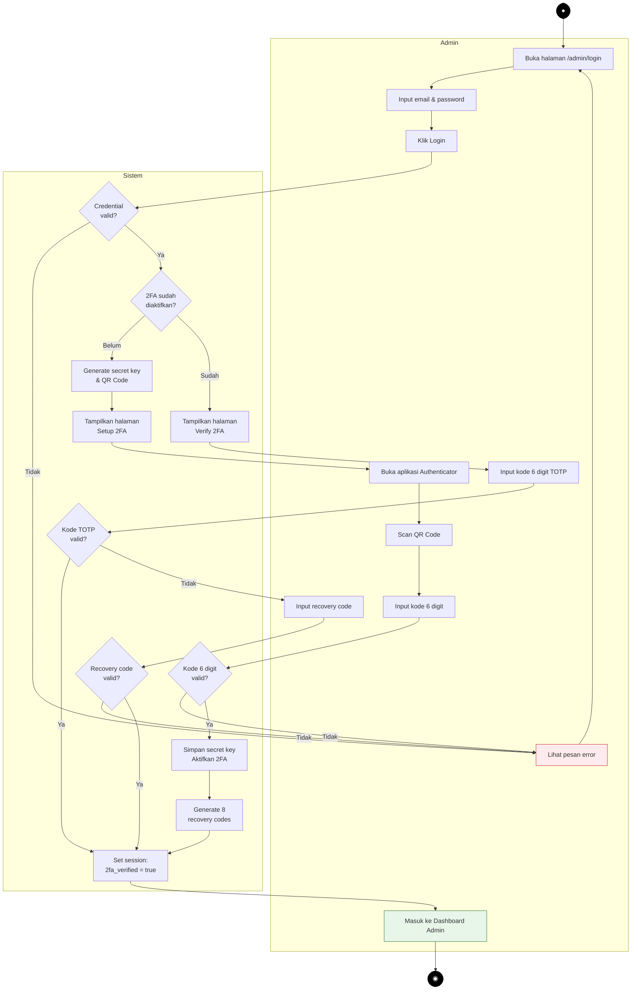

**Penjelasan langkah-langkah:**
1. Admin membuka halaman `/admin/login` dan memasukkan email + password.
2. Sistem memvalidasi credential. Jika gagal → error.
3. Sistem mengecek apakah 2FA sudah diaktifkan.
4. **Jika belum**: generate QR Code → admin scan → input kode 6 digit → validasi → aktifkan 2FA → generate recovery codes.
5. **Jika sudah**: tampilkan halaman verify → admin input kode 6 digit TOTP.
6. Jika kode valid → set session `2fa_verified = true` → masuk ke dashboard.
7. Jika kode tidak valid → opsi menggunakan recovery code.

### 17.6 Activity Diagram — Proses Kelola Data Pegawai (CRUD)

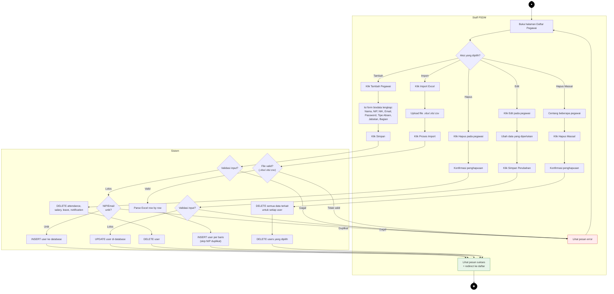

**Penjelasan langkah-langkah:**
1. Staff PSDM membuka halaman Daftar Pegawai.
2. Memilih aksi: **Tambah** (isi form → validasi → INSERT), **Edit** (ubah data → validasi → UPDATE), **Hapus** (konfirmasi → cascade delete data terkait → DELETE user), **Import Excel** (upload file → parse → INSERT per baris, skip duplikat), atau **Hapus Massal** (pilih beberapa → cascade delete → DELETE).
3. Setiap aksi melalui validasi server-side (format, ukuran, keunikan NIP/email).
4. Saat hapus pegawai, semua data terkait (attendance, salary, leave, leave_balance, business_trip, notification) dihapus terlebih dahulu untuk menghindari data orphan.
5. Hasil aksi ditampilkan dengan pesan sukses atau error.

### 17.7 Activity Diagram — Proses Pengajuan dan Persetujuan Dinas Luar

```mermaid
flowchart TD
    Start(["●"]) --> A

    subgraph "Pegawai Kontrak"
        A["Buka form Pengajuan Dinas Luar"]
        B["Isi tanggal mulai & berakhir"]
        C["Isi tujuan dinas"]
        D["Isi maksud/tujuan perjalanan"]
        E["Upload lampiran SPPD (opsional)"]
        F["Klik Kirim Pengajuan"]
        WAIT["Menunggu persetujuan..."]
        NOTIF_OK["Terima notifikasi:\nDinas Luar Disetujui ✅"]
        NOTIF_NO["Terima notifikasi:\nDinas Luar Ditolak ❌"]
        ERR["Lihat pesan error,\nperbaiki input"]
    end

    subgraph "Sistem"
        G{"Validasi input\nserver-side"}
        H{"Cek overlap dengan\ncuti/dinas lain"}
        I["Simpan business_trip\nstatus = PENDING"]
        J["Kirim notifikasi ke\nsemua Staff PSDM"]
    end

    subgraph "Staff PSDM"
        K["Buka daftar pengajuan dinas luar"]
        L["Review pengajuan"]
        M{"Keputusan"}
        N["Klik SETUJUI"]
        O["Input alasan penolakan"]
        P["Klik TOLAK"]
    end

    subgraph "Sistem (Proses Persetujuan)"
        Q["Update status = APPROVED"]
        R["Auto-buat attendance dinas_luar\nper hari kerja (skip weekend)"]
        S["Kirim notifikasi ke pegawai"]
        T["Update status = REJECTED"]
        U["Simpan alasan penolakan"]
        V["Kirim notifikasi ke pegawai"]
    end

    A --> B --> C --> D --> E --> F
    F --> G
    G -- Gagal --> ERR
    ERR --> A
    G -- Lolos --> H
    H -- Overlap --> ERR
    H -- Tidak overlap --> I
    I --> J
    J --> WAIT

    J --> K
    K --> L
    L --> M
    M -- Setujui --> N
    N --> Q
    Q --> R
    R --> S
    S --> NOTIF_OK

    M -- Tolak --> O
    O --> P
    P --> T
    T --> U
    U --> V
    V --> NOTIF_NO

    NOTIF_OK --> End(["◉"])
    NOTIF_NO --> End2(["◉"])

    style Start fill:#000,stroke:#000,color:#fff
    style End fill:#000,stroke:#000,color:#fff
    style End2 fill:#000,stroke:#000,color:#fff
    style ERR fill:#FFEBEE,stroke:#C62828
    style NOTIF_OK fill:#E8F5E9,stroke:#2E7D32
    style NOTIF_NO fill:#FFEBEE,stroke:#C62828
    style WAIT fill:#FFF9C4,stroke:#F9A825
```

**Penjelasan langkah-langkah:**
1. Pegawai membuka form pengajuan dinas luar dan mengisi data (tanggal, tujuan, maksud, lampiran SPPD).
2. Sistem memvalidasi input dan mengecek overlap tanggal dengan pengajuan cuti/dinas lain yang masih pending atau approved.
3. Jika valid, pengajuan disimpan dengan status `PENDING` dan notifikasi dikirim ke semua Staff PSDM.
4. Staff PSDM membuka daftar pengajuan, me-review, dan memutuskan approve atau reject.
5. Jika **disetujui**: sistem otomatis membuat record attendance `status=dinas_luar` untuk setiap hari kerja dalam rentang dinas (weekend di-skip), lalu mengirim notifikasi ke pegawai.
6. Jika **ditolak**: staff wajib mengisi alasan penolakan, sistem menyimpan dan mengirim notifikasi ke pegawai.

### 17.8 Activity Diagram — Proses Import Gaji dari Excel

```mermaid
flowchart TD
    Start(["●"]) --> A

    subgraph "Staff Keuangan"
        A["Buka halaman Import Gaji"]
        B["Pilih bulan & tahun periode"]
        C["Pilih opsi: Overwrite data yang sudah ada?"]
        D["Upload file Excel (.xlsx/.xls/.csv)"]
        E["Klik Proses Import"]
        TMPL["Klik Download Template"]
        DONE["Lihat pesan sukses:\nX data berhasil diimport"]
        ERR["Lihat pesan error"]
    end

    subgraph "Sistem"
        F{"Validasi file:\nformat & ukuran?"}
        G["Parse file Excel baris per baris"]
        H{"Untuk setiap baris:"}
        I{"NIP ditemukan\ndi database?"}
        J{"Gaji sudah ada\nuntuk periode ini?"}
        K{"Opsi overwrite\naktif?"}
        L["UPDATE salary record"]
        M["INSERT salary record baru"]
        N["Skip baris + catat error"]
        O["Tampilkan ringkasan:\nsukses, gagal, error detail"]
        P["Generate file template\nExcel kosong"]
    end

    A --> B --> C --> D --> E
    E --> F
    F -- Tidak valid --> ERR
    ERR --> A
    F -- Valid --> G
    G --> H
    H --> I
    I -- Tidak --> N
    I -- Ya --> J
    J -- Belum ada --> M
    J -- Sudah ada --> K
    K -- Tidak --> N
    K -- Ya --> L
    L --> O
    M --> O
    N --> O
    O --> DONE

    TMPL --> P
    P --> TMPL

    DONE --> End(["◉"])

    style Start fill:#000,stroke:#000,color:#fff
    style End fill:#000,stroke:#000,color:#fff
    style ERR fill:#FFEBEE,stroke:#C62828
    style DONE fill:#E8F5E9,stroke:#2E7D32
    style N fill:#FFF3E0,stroke:#E65100
```

**Penjelasan langkah-langkah:**
1. Staff Keuangan membuka halaman Import Gaji, memilih periode (bulan/tahun), dan opsi overwrite.
2. Staff mengunggah file Excel yang sudah diisi sesuai template (bisa diunduh terlebih dahulu).
3. Sistem memvalidasi format file (harus .xlsx/.xls/.csv) dan ukuran (maks 10MB).
4. File di-parse baris per baris: cari user berdasarkan NIP → cek apakah gaji sudah ada → jika overwrite aktif maka update, jika tidak maka skip.
5. Baris yang NIP-nya tidak ditemukan di database akan di-skip dan dicatat sebagai error.
6. Hasil import ditampilkan: jumlah sukses, jumlah gagal, dan detail error per baris.

### 17.9 Activity Diagram — Proses CRUD Pengumuman

```mermaid
flowchart TD
    Start(["●"]) --> A

    subgraph "Staff PSDM"
        A["Buka halaman Daftar Pengumuman"]
        B{"Aksi yang dipilih?"}

        C1["Klik Tambah Pengumuman"]
        C2["Isi judul & konten"]
        C3["Centang 'Aktifkan' (opsional)"]
        C4["Klik Simpan"]

        D1["Klik Edit pada pengumuman"]
        D2["Ubah judul/konten/status"]
        D3["Klik Simpan Perubahan"]

        E1["Klik Toggle Aktif/Nonaktif"]

        F1["Klik Hapus pengumuman"]
        F2["Konfirmasi penghapusan"]

        DONE["Lihat pesan sukses"]
        ERR["Lihat pesan error"]
    end

    subgraph "Sistem"
        V1{"Validasi input:\njudul & konten wajib?"}
        S1["INSERT announcement"]
        S1b{"Status aktif?"}
        S1c["Kirim notifikasi ke\nSEMUA pegawai"]

        V2{"Validasi input?"}
        S2["UPDATE announcement"]

        S3["Toggle is_active\n(true ↔ false)"]

        S4["Hapus notifikasi terkait"]
        S5["DELETE announcement"]
    end

    A --> B
    B -- Tambah --> C1 --> C2 --> C3 --> C4
    C4 --> V1
    V1 -- Gagal --> ERR
    V1 -- Lolos --> S1
    S1 --> S1b
    S1b -- Ya --> S1c --> DONE
    S1b -- Tidak --> DONE

    B -- Edit --> D1 --> D2 --> D3
    D3 --> V2
    V2 -- Gagal --> ERR
    V2 -- Lolos --> S2 --> DONE

    B -- Toggle --> E1
    E1 --> S3 --> DONE

    B -- Hapus --> F1 --> F2
    F2 --> S4 --> S5 --> DONE

    ERR --> A
    DONE --> End(["◉"])

    style Start fill:#000,stroke:#000,color:#fff
    style End fill:#000,stroke:#000,color:#fff
    style ERR fill:#FFEBEE,stroke:#C62828
    style DONE fill:#E8F5E9,stroke:#2E7D32
```

**Penjelasan langkah-langkah:**
1. Staff PSDM membuka halaman Daftar Pengumuman.
2. **Tambah**: isi judul dan konten → validasi → simpan. Jika status aktif dicentang, sistem otomatis mengirim notifikasi in-app ke seluruh pegawai.
3. **Edit**: ubah judul/konten/status → validasi → update.
4. **Toggle**: mengubah status aktif/nonaktif tanpa membuka form edit.
5. **Hapus**: konfirmasi → hapus notifikasi terkait pengumuman tersebut → hapus pengumuman.

### 17.10 Activity Diagram — Proses Monitor dan Ekspor Presensi

```mermaid
flowchart TD
    Start(["●"]) --> A

    subgraph "Staff PSDM / Admin"
        A["Buka halaman Monitor Presensi"]
        B["Pilih filter:\ntanggal / bulan / semua"]
        C["Pilih filter status:\npresent / late / cuti / absent"]
        D["Ketik pencarian nama/NIP\n(opsional)"]
        E["Klik Filter / Cari"]
        G["Lihat tabel presensi\n(pagination 20/halaman)"]
        H{"Aksi lanjutan?"}
        I["Klik Hapus Record"]
        J["Konfirmasi penghapusan"]
        K["Klik Ekspor Excel"]
        L["Pilih tipe ekspor:\nper hari / per bulan / semua"]
        DONE["Lihat pesan sukses"]
    end

    subgraph "Sistem"
        F["Query attendance\ndengan filter & pagination"]
        M["DELETE attendance record"]
        N["Generate file Excel\n(AttendanceExport)"]
        O["File .xlsx terunduh"]
    end

    A --> B --> C --> D --> E
    E --> F
    F --> G
    G --> H
    H -- Hapus Record --> I --> J
    J --> M --> DONE
    H -- Ekspor --> K --> L
    L --> N --> O
    H -- Filter Lagi --> B

    DONE --> End(["◉"])
    O --> End2(["◉"])

    style Start fill:#000,stroke:#000,color:#fff
    style End fill:#000,stroke:#000,color:#fff
    style End2 fill:#000,stroke:#000,color:#fff
    style DONE fill:#E8F5E9,stroke:#2E7D32
    style O fill:#E8F5E9,stroke:#2E7D32
```

**Penjelasan langkah-langkah:**
1. Staff PSDM atau Admin membuka halaman Monitor Presensi.
2. Memilih filter: tanggal spesifik, bulan/tahun, atau tanpa filter (semua data). Bisa juga filter berdasarkan status dan pencarian nama/NIP.
3. Sistem menjalankan query dengan filter dan menampilkan hasil dalam tabel dengan pagination 20 record per halaman.
4. Staff PSDM dapat melakukan aksi lanjutan: **Hapus Record** (konfirmasi → delete) atau **Ekspor Excel** (pilih tipe → generate file → download).
5. Admin hanya dapat melihat data (read-only) dan mengekspor, tanpa opsi hapus.

### 17.11 Activity Diagram — Proses Kelola Shift Kerja

```mermaid
flowchart TD
    Start(["●"]) --> A

    subgraph "Admin"
        A["Buka halaman Pengaturan"]
        B["Scroll ke bagian Manajemen Shift"]
        C{"Aksi yang dipilih?"}

        D1["Klik Tambah Shift"]
        D2["Isi nama, tipe (normal/shift),\njam mulai, jam akhir,\ntoleransi terlambat (menit)"]
        D3["Klik Simpan"]

        E1["Klik Edit pada shift"]
        E2["Ubah jam/toleransi"]
        E3["Klik Simpan Perubahan"]

        F1["Klik Hapus shift"]
        F2["Konfirmasi penghapusan"]

        DONE["Lihat pesan sukses"]
        ERR["Lihat pesan error"]
    end

    subgraph "Sistem"
        V1{"Validasi input:\nnama, waktu wajib?"}
        S1["INSERT shift ke database"]

        V2{"Validasi input?"}
        S2["Bandingkan nilai lama vs baru"]
        S3{"Ada perubahan?"}
        S4["INSERT shift_logs\n(field, old_value, new_value,\nchanged_by)"]
        S5["UPDATE shift"]

        S6{"Shift digunakan\ndi attendance?"}
        S7["DELETE shift"]
        S8["TOLAK: shift masih\ndigunakan"]
    end

    A --> B --> C
    C -- Tambah --> D1 --> D2 --> D3
    D3 --> V1
    V1 -- Gagal --> ERR
    V1 -- Lolos --> S1 --> DONE

    C -- Edit --> E1 --> E2 --> E3
    E3 --> V2
    V2 -- Gagal --> ERR
    V2 -- Lolos --> S2 --> S3
    S3 -- Ya --> S4 --> S5 --> DONE
    S3 -- Tidak --> S5

    C -- Hapus --> F1 --> F2
    F2 --> S6
    S6 -- Ya --> S8 --> ERR
    S6 -- Tidak --> S7 --> DONE

    ERR --> A
    DONE --> End(["◉"])

    style Start fill:#000,stroke:#000,color:#fff
    style End fill:#000,stroke:#000,color:#fff
    style ERR fill:#FFEBEE,stroke:#C62828
    style DONE fill:#E8F5E9,stroke:#2E7D32
```

**Penjelasan langkah-langkah:**
1. Admin membuka halaman Pengaturan dan menuju bagian Manajemen Shift.
2. **Tambah**: isi nama, tipe (normal/shift), jam mulai, jam berakhir, dan toleransi keterlambatan → validasi → simpan.
3. **Edit**: ubah konfigurasi shift → sistem membandingkan nilai lama dengan baru → jika ada perubahan, catat ke `shift_logs` (audit trail: field apa yang berubah, nilai lama, nilai baru, siapa yang mengubah) → update shift.
4. **Hapus**: sistem mengecek apakah shift masih digunakan di record attendance. Jika ya → tolak hapus. Jika tidak → hapus shift.

### 17.12 Activity Diagram — Proses Kelola Akun Staff dan Admin

```mermaid
flowchart TD
    Start(["●"]) --> A

    subgraph "Admin"
        A["Buka halaman Kelola Staff/Admin"]
        B{"Kelola siapa?"}

        C1["Buka tab Daftar Staff"]
        C2{"Aksi?"}
        C3["Klik Tambah Staff"]
        C4["Isi nama, email, password,\nrole (staff_psdm/staff_keuangan)"]
        C5["Klik Simpan"]
        C6["Klik Edit pada staff"]
        C7["Ubah data"]
        C8["Klik Simpan"]
        C9["Klik Hapus staff"]
        C10["Konfirmasi"]

        D1["Buka tab Daftar Admin"]
        D2{"Aksi?"}
        D3["Klik Tambah Admin"]
        D4["Isi nama, email, password"]
        D5["Klik Simpan"]
        D6["Klik Edit pada admin"]
        D7["Ubah data"]
        D8["Klik Simpan"]

        DONE["Lihat pesan sukses"]
        ERR["Lihat pesan error"]
    end

    subgraph "Sistem"
        V1{"Validasi input:\nemail unik? password kuat?"}
        S1["INSERT user dengan\nrole = staff_psdm/staff_keuangan"]

        V2{"Validasi input?"}
        S2["UPDATE user"]

        S3{"Hapus diri sendiri?"}
        S4["TOLAK: tidak bisa\nhapus akun sendiri"]
        S5["DELETE user"]

        V3{"Validasi input:\nemail unik? password kuat?"}
        S6["INSERT user dengan\nrole = admin"]

        V4{"Validasi input?"}
        S7["UPDATE user"]
    end

    A --> B
    B -- Staff --> C1 --> C2
    C2 -- Tambah --> C3 --> C4 --> C5
    C5 --> V1
    V1 -- Gagal --> ERR
    V1 -- Lolos --> S1 --> DONE

    C2 -- Edit --> C6 --> C7 --> C8
    C8 --> V2
    V2 -- Gagal --> ERR
    V2 -- Lolos --> S2 --> DONE

    C2 -- Hapus --> C9 --> C10
    C10 --> S3
    S3 -- Ya --> S4 --> ERR
    S3 -- Tidak --> S5 --> DONE

    B -- Admin --> D1 --> D2
    D2 -- Tambah --> D3 --> D4 --> D5
    D5 --> V3
    V3 -- Gagal --> ERR
    V3 -- Lolos --> S6 --> DONE

    D2 -- Edit --> D6 --> D7 --> D8
    D8 --> V4
    V4 -- Gagal --> ERR
    V4 -- Lolos --> S7 --> DONE

    ERR --> A
    DONE --> End(["◉"])

    style Start fill:#000,stroke:#000,color:#fff
    style End fill:#000,stroke:#000,color:#fff
    style ERR fill:#FFEBEE,stroke:#C62828
    style DONE fill:#E8F5E9,stroke:#2E7D32
    style S4 fill:#FFEBEE,stroke:#C62828
```

**Penjelasan langkah-langkah:**
1. Admin membuka halaman Kelola Staff atau Kelola Admin.
2. **Tambah Staff**: isi nama, email, password (min 8 karakter, huruf besar+kecil, angka, simbol), pilih role (staff_psdm atau staff_keuangan) → validasi → simpan.
3. **Edit Staff**: ubah data → validasi (email tetap unik) → update.
4. **Hapus Staff**: sistem mengecek apakah admin mencoba menghapus dirinya sendiri. Jika ya → tolak. Jika tidak → hapus.
5. **Tambah/Edit Admin**: alur serupa, dengan role otomatis `admin`. Admin baru saat login pertama kali akan diarahkan ke setup 2FA.

### 17.13 Activity Diagram — Proses Pengaturan Lokasi Geofencing

```mermaid
flowchart TD
    Start(["●"]) --> A

    subgraph "Admin"
        A["Buka halaman Pengaturan"]
        B["Lihat konfigurasi lokasi\nsaat ini (lat, long, radius)"]
        C["Ubah nilai Latitude kantor"]
        D["Ubah nilai Longitude kantor"]
        E["Ubah nilai Radius (meter)"]
        F["Klik Simpan Pengaturan"]
        DONE["Lihat pesan sukses:\nPengaturan berhasil disimpan"]
        ERR["Lihat pesan error"]
    end

    subgraph "Sistem"
        G{"Validasi input:\nnumerik? range valid?"}
        H["UPDATE settings\nkey = office_latitude"]
        I["UPDATE settings\nkey = office_longitude"]
        J["UPDATE settings\nkey = allowed_radius_meters"]
        K["Pengaturan berlaku untuk\npresensi berikutnya"]
    end

    A --> B --> C --> D --> E --> F
    F --> G
    G -- Gagal --> ERR
    ERR --> A
    G -- Lolos --> H --> I --> J --> K --> DONE

    DONE --> End(["◉"])

    style Start fill:#000,stroke:#000,color:#fff
    style End fill:#000,stroke:#000,color:#fff
    style ERR fill:#FFEBEE,stroke:#C62828
    style DONE fill:#E8F5E9,stroke:#2E7D32
```

**Penjelasan langkah-langkah:**
1. Admin membuka halaman Pengaturan dan melihat konfigurasi lokasi geofencing saat ini.
2. Admin mengubah nilai latitude, longitude, dan/atau radius (dalam meter).
3. Sistem memvalidasi input (harus numerik, dalam range yang valid).
4. Jika valid, ketiga nilai disimpan/diperbarui di tabel `settings` (key-value store).
5. Perubahan berlaku langsung untuk proses presensi berikutnya — pegawai yang melakukan check-in setelah perubahan akan divalidasi terhadap koordinat dan radius yang baru.

### 17.14 Activity Diagram — Proses Edit Profil dan Foto

```mermaid
flowchart TD
    Start(["●"]) --> A

    subgraph "Pengguna (Semua Role)"
        A["Buka halaman Edit Profil"]
        B["Lihat data profil saat ini"]
        C{"Aksi yang dipilih?"}

        D1["Ubah nama dan/atau email"]
        D2["Klik Simpan Profil"]

        E1["Pilih foto baru dari perangkat\n(JPEG/PNG/GIF, maks 2MB)"]
        E2["Klik Upload Foto"]

        F1["Klik Hapus Foto"]

        G1["Isi password lama"]
        G2["Isi password baru\n(min 8 karakter, huruf besar+kecil,\nangka, simbol)"]
        G3["Konfirmasi password baru"]
        G4["Klik Ubah Password"]

        H1["Isi password untuk konfirmasi"]
        H2["Klik Hapus Akun"]

        DONE["Lihat pesan sukses"]
        ERR["Lihat pesan error"]
    end

    subgraph "Sistem"
        V1{"Validasi:\nemail valid & unik?"}
        S1["UPDATE nama & email"]
        S1b{"Email berubah?"}
        S1c["Reset email_verified_at = null"]

        V2{"Validasi:\nformat image? ukuran ≤ 2MB?"}
        S2["Hapus foto lama dari storage"]
        S3["Simpan foto baru ke\nstorage/profile-photos"]
        S4["UPDATE profile_photo di DB"]

        S5["Hapus foto dari storage"]
        S6["SET profile_photo = null"]

        V3{"Validasi:\npassword lama benar?\npassword baru valid?"}
        S7["UPDATE password\n(bcrypt 12 rounds)"]

        V4{"Password konfirmasi benar?"}
        S8["Logout user"]
        S9["Hapus foto dari storage"]
        S10["DELETE user dari database"]
        S11["Invalidasi session"]
        S12["Redirect ke halaman login"]
    end

    A --> B --> C

    C -- Edit Profil --> D1 --> D2
    D2 --> V1
    V1 -- Gagal --> ERR
    V1 -- Lolos --> S1 --> S1b
    S1b -- Ya --> S1c --> DONE
    S1b -- Tidak --> DONE

    C -- Upload Foto --> E1 --> E2
    E2 --> V2
    V2 -- Gagal --> ERR
    V2 -- Lolos --> S2 --> S3 --> S4 --> DONE

    C -- Hapus Foto --> F1
    F1 --> S5 --> S6 --> DONE

    C -- Ganti Password --> G1 --> G2 --> G3 --> G4
    G4 --> V3
    V3 -- Gagal --> ERR
    V3 -- Lolos --> S7 --> DONE

    C -- Hapus Akun --> H1 --> H2
    H2 --> V4
    V4 -- Gagal --> ERR
    V4 -- Lolos --> S8 --> S9 --> S10 --> S11 --> S12

    ERR --> A
    DONE --> End(["◉"])
    S12 --> End2(["◉"])

    style Start fill:#000,stroke:#000,color:#fff
    style End fill:#000,stroke:#000,color:#fff
    style End2 fill:#000,stroke:#000,color:#fff
    style ERR fill:#FFEBEE,stroke:#C62828
    style DONE fill:#E8F5E9,stroke:#2E7D32
    style S12 fill:#FFF3E0,stroke:#E65100
```

**Penjelasan langkah-langkah:**
1. Pengguna (semua role) membuka halaman Edit Profil.
2. **Edit Profil**: ubah nama/email → validasi (email harus valid dan unik) → simpan. Jika email berubah, status verifikasi email di-reset.
3. **Upload Foto**: pilih file gambar (JPEG/PNG/GIF, maks 2MB) → validasi format dan ukuran → hapus foto lama dari storage → simpan foto baru → update path di database.
4. **Hapus Foto**: hapus file dari storage → set `profile_photo = null`.
5. **Ganti Password**: isi password lama (verifikasi) → isi password baru (min 8 karakter, huruf besar+kecil, angka, simbol) → konfirmasi → update dengan bcrypt 12 rounds.
6. **Hapus Akun**: konfirmasi dengan password → logout → hapus foto dari storage → hapus user dari database → invalidasi session → redirect ke login.

### 17.15 Activity Diagram — Login Pegawai dan Staff (Non-2FA)

```mermaid
flowchart TD
    Start(["●"]) --> A
    subgraph "Pegawai / Staff"
        A["Buka halaman login:\n/login atau /staff/login"]
        B["Input email & password"]
        C["Klik Login"]
        DONE["Masuk ke Dashboard\nsesuai role"]
        ERR["Pesan error:\nemail/password salah"]
    end
    subgraph "Sistem"
        D{"Credential valid?"}
        E["Generate session"]
        F["Regenerasi CSRF token"]
        G{"Role?"}
    end
    A --> B --> C --> D
    D -- Tidak --> ERR --> A
    D -- Ya --> E --> F --> G
    G -- user --> DONE
    G -- staff_psdm --> DONE
    G -- staff_keuangan --> DONE
    DONE --> End(["◉"])
    style Start fill:#000,stroke:#000,color:#fff
    style End fill:#000,stroke:#000,color:#fff
    style ERR fill:#FFEBEE,stroke:#C62828
    style DONE fill:#E8F5E9,stroke:#2E7D32
```

**Penjelasan:** Pegawai buka `/login`, Staff buka `/staff/login` → input email & password → validasi bcrypt → generate session → redirect ke dashboard sesuai role.

### 17.16 Activity Diagram — Lupa Password (Forgot Password)

```mermaid
flowchart TD
    Start(["●"]) --> A
    subgraph "Pengguna"
        A["Klik Lupa Password\ndi halaman login"]
        B["Masukkan email"]
        C["Klik Kirim Link Reset"]
        INFO["Pesan: Link reset\ndikirim ke email"]
        D["Buka email,\nklik link reset"]
        E["Input password baru"]
        F["Konfirmasi password"]
        G["Klik Reset Password"]
        DONE["Password berhasil direset\nRedirect ke login"]
        ERR["Pesan error"]
    end
    subgraph "Sistem"
        H{"Email terdaftar?"}
        I["Generate token reset\n(expired 60 menit)"]
        J["Kirim email berisi\nlink /reset-password/token"]
        K{"Token valid &\nbelum expired?"}
        L{"Password baru valid?\nKonfirmasi cocok?"}
        M["UPDATE password\n(bcrypt 12 rounds)"]
        N["Hapus token reset"]
    end
    A --> B --> C --> H
    H -- Tidak --> ERR --> A
    H -- Ya --> I --> J --> INFO
    INFO --> D --> K
    K -- Tidak --> ERR
    K -- Ya --> E --> F --> G --> L
    L -- Gagal --> ERR
    L -- Lolos --> M --> N --> DONE
    DONE --> End(["◉"])
    style Start fill:#000,stroke:#000,color:#fff
    style End fill:#000,stroke:#000,color:#fff
    style ERR fill:#FFEBEE,stroke:#C62828
    style DONE fill:#E8F5E9,stroke:#2E7D32
    style INFO fill:#FFF9C4,stroke:#F9A825
```

**Penjelasan:** Klik Lupa Password → masukkan email → sistem cek email terdaftar → generate token (expired 60 menit) → kirim email berisi link reset → pengguna klik link → input password baru + konfirmasi → validasi → update password → redirect ke login.

### 17.17 Activity Diagram — Lihat Dashboard Pegawai

```mermaid
flowchart TD
    Start(["●"]) --> A
    subgraph "Pegawai"
        A["Masuk Dashboard"]
        DONE["Melihat Dashboard lengkap"]
    end
    subgraph "Sistem"
        B["Query pengumuman aktif"]
        C["Query attendance hari ini"]
        D["Query shift berlaku"]
        E["Hitung statistik bulanan"]
        F["Query cuti & dinas pending"]
        G["Query notifikasi unread"]
        H["Render Dashboard"]
    end
    A --> B --> C --> D --> E --> F --> G --> H --> DONE
    DONE --> End(["◉"])
    style Start fill:#000,stroke:#000,color:#fff
    style End fill:#000,stroke:#000,color:#fff
    style DONE fill:#E8F5E9,stroke:#2E7D32
```

**Penjelasan:** Dashboard menampilkan: pengumuman aktif, status presensi hari ini, shift berlaku, statistik bulanan (hadir/terlambat/tepat waktu), pengajuan pending, notifikasi belum dibaca.

### 17.18 Activity Diagram — Lihat Dashboard Staff PSDM

```mermaid
flowchart TD
    Start(["●"]) --> A
    subgraph "Staff PSDM"
        A["Masuk Dashboard"]
        DONE["Melihat Dashboard\nstatistik + grafik"]
    end
    subgraph "Sistem"
        B["Hitung total pegawai aktif"]
        C["Hitung kehadiran hari ini"]
        D["Query presensi 7 hari\nuntuk grafik bar (Chart.js)"]
        E["Hitung distribusi status\nbulan ini untuk pie chart"]
        F["Query pengajuan\ncuti & dinas pending"]
        G["Render Dashboard + grafik"]
    end
    A --> B --> C --> D --> E --> F --> G --> DONE
    DONE --> End(["◉"])
    style Start fill:#000,stroke:#000,color:#fff
    style End fill:#000,stroke:#000,color:#fff
    style DONE fill:#E8F5E9,stroke:#2E7D32
```

**Penjelasan:** Dashboard menampilkan: total pegawai, kehadiran hari ini, grafik bar 7 hari, pie chart bulanan, pengajuan menunggu approval.

### 17.19 Activity Diagram — Lihat Dashboard Staff Keuangan

```mermaid
flowchart TD
    Start(["●"]) --> A
    subgraph "Staff Keuangan"
        A["Masuk Dashboard"]
        DONE["Melihat Dashboard\nstatistik gaji"]
    end
    subgraph "Sistem"
        B["Hitung total pegawai"]
        C["Hitung gaji diproses bulan ini"]
        D["Hitung gaji belum diproses"]
        E["Hitung total pengeluaran"]
        F["Query 5 gaji terbaru"]
        G["Render Dashboard + tabel"]
    end
    A --> B --> C --> D --> E --> F --> G --> DONE
    DONE --> End(["◉"])
    style Start fill:#000,stroke:#000,color:#fff
    style End fill:#000,stroke:#000,color:#fff
    style DONE fill:#E8F5E9,stroke:#2E7D32
```

**Penjelasan:** Dashboard menampilkan: total pegawai, gaji diproses/belum, total pengeluaran bulan ini, 5 data gaji terbaru.

### 17.20 Activity Diagram — Lihat Dashboard Admin

```mermaid
flowchart TD
    Start(["●"]) --> A
    subgraph "Admin"
        A["Masuk Dashboard\n(setelah 2FA)"]
        DONE["Melihat Dashboard:\ntabel presensi hari ini"]
    end
    subgraph "Sistem"
        B["Query presensi hari ini\nseluruh pegawai"]
        C["Query pegawai belum absen"]
        D["Load shift aktif"]
        E["Render Dashboard +\ntabel presensi lengkap"]
    end
    A --> B --> C --> D --> E --> DONE
    DONE --> End(["◉"])
    style Start fill:#000,stroke:#000,color:#fff
    style End fill:#000,stroke:#000,color:#fff
    style DONE fill:#E8F5E9,stroke:#2E7D32
```

**Penjelasan:** Dashboard Admin menampilkan tabel presensi hari ini seluruh pegawai beserta status dan shift masing-masing. Monitoring saja — input absen manual dilakukan oleh Staff PSDM.

### 17.21 Activity Diagram — Tambah Data Pegawai (Staff PSDM)

```mermaid
flowchart TD
    Start(["●"]) --> A
    subgraph "Staff PSDM"
        A["Klik Tambah Pegawai"]
        B["Isi form:\nNama, NIP (18 digit),\nNIK (16 digit), Email,\nPassword, Tipe Absen"]
        C["Pilih Jabatan, Bagian,\nStatus dari Master Data"]
        D["Isi data opsional:\nalamat, HP, TTL, gender"]
        E["Klik Simpan"]
        DONE["Sukses + redirect\nke daftar pegawai"]
        ERR["Pesan error validasi"]
    end
    subgraph "Sistem"
        F{"Validasi: field\nwajib terisi?"}
        G{"NIP 18 digit & unik?"}
        H{"NIK 16 digit & unik?"}
        I{"Email valid & unik?"}
        J{"Password memenuhi\nkriteria keamanan?"}
        K["Hash password\n(bcrypt 12 rounds)"]
        L["INSERT user\nrole = user"]
        M["Catat Activity Log"]
    end
    A --> B --> C --> D --> E --> F
    F -- Gagal --> ERR --> B
    F -- Lolos --> G
    G -- Duplikat --> ERR
    G -- Unik --> H
    H -- Duplikat --> ERR
    H -- Unik --> I
    I -- Duplikat --> ERR
    I -- Unik --> J
    J -- Gagal --> ERR
    J -- Lolos --> K --> L --> M --> DONE
    DONE --> End(["◉"])
    style Start fill:#000,stroke:#000,color:#fff
    style End fill:#000,stroke:#000,color:#fff
    style ERR fill:#FFEBEE,stroke:#C62828
    style DONE fill:#E8F5E9,stroke:#2E7D32
```

**Penjelasan:** Isi form biodata lengkap → validasi bertingkat (field wajib, NIP 18 digit unik, NIK 16 digit unik, email unik, password kuat) → hash password → insert user → catat Activity Log.

### 17.22 Activity Diagram — Edit Data Pegawai (Staff PSDM)

```mermaid
flowchart TD
    Start(["●"]) --> A
    subgraph "Staff PSDM"
        A["Klik Edit pada pegawai"]
        B["Form terisi data saat ini"]
        C["Ubah field yang diperlukan"]
        D["Klik Simpan Perubahan"]
        DONE["Sukses + redirect"]
        ERR["Pesan error"]
    end
    subgraph "Sistem"
        E{"Validasi input?"}
        F{"NIP/NIK/Email tetap unik?\n(exclude user ini)"}
        G{"Password diubah?"}
        H["Hash password baru"]
        I["UPDATE user"]
        J["Catat Activity Log\n(old_values, new_values)"]
    end
    A --> B --> C --> D --> E
    E -- Gagal --> ERR --> B
    E -- Lolos --> F
    F -- Duplikat --> ERR
    F -- Unik --> G
    G -- Ya --> H --> I
    G -- Tidak --> I
    I --> J --> DONE
    DONE --> End(["◉"])
    style Start fill:#000,stroke:#000,color:#fff
    style End fill:#000,stroke:#000,color:#fff
    style ERR fill:#FFEBEE,stroke:#C62828
    style DONE fill:#E8F5E9,stroke:#2E7D32
```

**Penjelasan:** Klik Edit → form terisi data saat ini → ubah → validasi (keunikan di-exclude untuk user ini) → jika password diubah hash ulang → update → catat perubahan ke Activity Log (nilai lama & baru).

### 17.23 Activity Diagram — Hapus Data Pegawai (Staff PSDM)

```mermaid
flowchart TD
    Start(["●"]) --> A
    subgraph "Staff PSDM"
        A["Klik Hapus pada pegawai"]
        B["Konfirmasi penghapusan"]
        DONE["Sukses + refresh daftar"]
    end
    subgraph "Sistem"
        C["DELETE attendances"]
        D["DELETE salaries +\nsalary_deductions"]
        E["DELETE leaves +\nleave_balances"]
        F["DELETE business_trips"]
        G["DELETE notifications"]
        H["Hapus foto dari storage"]
        I["DELETE user"]
        J["Catat Activity Log"]
    end
    A --> B --> C --> D --> E --> F --> G --> H --> I --> J --> DONE
    DONE --> End(["◉"])
    style Start fill:#000,stroke:#000,color:#fff
    style End fill:#000,stroke:#000,color:#fff
    style DONE fill:#E8F5E9,stroke:#2E7D32
```

**Penjelasan:** Konfirmasi → cascade delete semua data terkait (attendance, salary, leave, business_trip, notification, foto) → hapus user → catat Activity Log.

### 17.24 Activity Diagram — Import Pegawai dari Excel (Staff PSDM)

```mermaid
flowchart TD
    Start(["●"]) --> A
    subgraph "Staff PSDM"
        A["Buka halaman Import"]
        B["Upload file Excel"]
        C["Klik Proses Import"]
        DONE["Ringkasan:\nX berhasil, Y gagal"]
        ERR["Pesan error format"]
    end
    subgraph "Sistem"
        D{"Format & ukuran valid?"}
        E["Parse baris per baris"]
        F{"NIP sudah ada?"}
        G["INSERT user baru"]
        H["Skip + catat duplikat"]
        I["Tampilkan ringkasan"]
    end
    A --> B --> C --> D
    D -- Tidak --> ERR --> A
    D -- Valid --> E --> F
    F -- Ya --> H --> I
    F -- Tidak --> G --> I
    I --> DONE
    DONE --> End(["◉"])
    style Start fill:#000,stroke:#000,color:#fff
    style End fill:#000,stroke:#000,color:#fff
    style ERR fill:#FFEBEE,stroke:#C62828
    style DONE fill:#E8F5E9,stroke:#2E7D32
```

**Penjelasan:** Upload Excel → validasi format → parse per baris → cek NIP duplikat → insert baru / skip duplikat → tampilkan ringkasan.

### 17.25 Activity Diagram — Hapus Massal Pegawai (Staff PSDM)

```mermaid
flowchart TD
    Start(["●"]) --> A
    subgraph "Staff PSDM"
        A["Centang beberapa pegawai"]
        B["Klik Hapus Massal"]
        C["Konfirmasi"]
        DONE["X pegawai dihapus"]
    end
    subgraph "Sistem"
        D["Untuk setiap pegawai:"]
        E["CASCADE DELETE semua\ndata terkait"]
        F["DELETE user"]
        G["Catat Activity Log"]
    end
    A --> B --> C --> D --> E --> F --> G --> DONE
    DONE --> End(["◉"])
    style Start fill:#000,stroke:#000,color:#fff
    style End fill:#000,stroke:#000,color:#fff
    style DONE fill:#E8F5E9,stroke:#2E7D32
```

**Penjelasan:** Centang beberapa → konfirmasi → cascade delete per pegawai (attendance, salary, leave, business_trip, notification) → hapus user.

### 17.26 Activity Diagram — Filter dan Cari Data Pegawai (Staff PSDM)

```mermaid
flowchart TD
    Start(["●"]) --> A
    subgraph "Staff PSDM"
        A["Buka Daftar Pegawai"]
        B["Ketik keyword\n(nama / NIP / email)"]
        C["Pilih filter tipe absen\n(opsional)"]
        D["Klik Filter / Enter"]
        F["Lihat tabel hasil\n(pagination 20/hal)"]
        G["Navigasi halaman"]
    end
    subgraph "Sistem"
        E["Query users WHERE\nname/nip/email LIKE keyword\nAND attendance_type = filter\nPAGINATE 20"]
    end
    A --> B --> C --> D --> E --> F
    F --> G --> E
    F --> End(["◉"])
    style Start fill:#000,stroke:#000,color:#fff
    style End fill:#000,stroke:#000,color:#fff
```

**Penjelasan:** Pencarian berdasarkan nama/NIP/email + filter tipe absen → query dengan LIKE + pagination 20 per halaman.

### 17.27 Activity Diagram — Lihat Rekap Presensi & Ekspor (Pegawai)

```mermaid
flowchart TD
    Start(["●"]) --> A
    subgraph "Pegawai"
        A["Buka Rekap Presensi"]
        B["Filter bulan & tahun"]
        C["Klik Filter"]
        E["Lihat tabel + statistik"]
        F{"Aksi?"}
        G["Klik Ekspor Excel"]
        DONE["File .xlsx terunduh"]
    end
    subgraph "Sistem"
        D["Query attendance milik\nuser, filter bulan/tahun"]
        H["Hitung: hadir, terlambat,\ntepat waktu, cuti, dinas, absen"]
        I["Generate Excel"]
    end
    A --> B --> C --> D --> H --> E
    E --> F
    F -- Ekspor --> G --> I --> DONE
    F -- Filter Lagi --> B
    DONE --> End(["◉"])
    style Start fill:#000,stroke:#000,color:#fff
    style End fill:#000,stroke:#000,color:#fff
    style DONE fill:#E8F5E9,stroke:#2E7D32
```

**Penjelasan:** Filter per bulan/tahun → sistem hitung statistik → tampilkan tabel → bisa ekspor ke Excel.

### 17.28 Activity Diagram — Lihat Riwayat & Batalkan Cuti (Pegawai)
(Ibrahim, 2006)
```mermaid
flowchart TD
    Start(["●"]) --> A
    subgraph "Pegawai"
        A["Buka Riwayat Cuti"]
        B["Lihat daftar pengajuan\n(Pending/Approved/Rejected)"]
        C{"Aksi?"}
        D["Klik Batalkan\n(hanya Pending)"]
        E["Konfirmasi"]
        DONE["Pengajuan dibatalkan"]
        ERR["Error: bukan Pending"]
    end
    subgraph "Sistem"
        F["Query leaves milik user"]
        G{"Status = Pending?"}
        H["DELETE leave"]
        I["Hapus notifikasi terkait"]
    end
    A --> F --> B --> C
    C -- Batalkan --> D --> E --> G
    G -- Tidak --> ERR --> B
    G -- Ya --> H --> I --> DONE
    DONE --> End(["◉"])
    style Start fill:#000,stroke:#000,color:#fff
    style End fill:#000,stroke:#000,color:#fff
    style ERR fill:#FFEBEE,stroke:#C62828
    style DONE fill:#E8F5E9,stroke:#2E7D32
```

**Penjelasan:** Lihat riwayat cuti → hanya bisa batalkan yang Pending → hapus record + notifikasi terkait.

### 17.29 Activity Diagram — Lihat Riwayat & Batalkan Dinas Luar (Pegawai)

```mermaid
flowchart TD
    Start(["●"]) --> A
    subgraph "Pegawai"
        A["Buka Riwayat Dinas Luar"]
        B["Lihat daftar pengajuan"]
        C{"Aksi?"}
        D["Klik Batalkan\n(hanya Pending)"]
        E["Konfirmasi"]
        DONE["Pengajuan dibatalkan"]
        ERR["Error: bukan Pending"]
    end
    subgraph "Sistem"
        F["Query business_trips milik user"]
        G{"Status = Pending?"}
        H["DELETE business_trip"]
        I["Hapus notifikasi terkait"]
    end
    A --> F --> B --> C
    C -- Batalkan --> D --> E --> G
    G -- Tidak --> ERR --> B
    G -- Ya --> H --> I --> DONE
    DONE --> End(["◉"])
    style Start fill:#000,stroke:#000,color:#fff
    style End fill:#000,stroke:#000,color:#fff
    style ERR fill:#FFEBEE,stroke:#C62828
    style DONE fill:#E8F5E9,stroke:#2E7D32
```

**Penjelasan:** Sama seperti cuti — hanya pengajuan Pending yang bisa dibatalkan.

### 17.30 Activity Diagram — Lihat Slip Gaji & Download PDF (Pegawai)

```mermaid
flowchart TD
    Start(["●"]) --> A
    subgraph "Pegawai"
        A["Buka halaman Slip Gaji"]
        B["Lihat daftar slip\n(Draft / Paid)"]
        C{"Aksi?"}
        D["Klik Detail"]
        E["Lihat rincian:\ngaji pokok, potongan KPPN,\npotongan intern per jenis,\ntotal, gaji diterima"]
        F["Klik Download PDF"]
        DONE["File PDF terunduh"]
        WARN["PDF tidak tersedia:\nslip belum ditandatangani"]
    end
    subgraph "Sistem"
        G["Query salaries + deductions"]
        H{"signed_at != null?"}
        I["Generate PDF via DomPDF"]
    end
    A --> G --> B --> C
    C -- Detail --> D --> E
    C -- Download --> F --> H
    H -- Belum --> WARN --> B
    H -- Sudah --> I --> DONE
    DONE --> End(["◉"])
    style Start fill:#000,stroke:#000,color:#fff
    style End fill:#000,stroke:#000,color:#fff
    style DONE fill:#E8F5E9,stroke:#2E7D32
    style WARN fill:#FFF3E0,stroke:#E65100
```

**Penjelasan:** Lihat daftar slip → detail rincian (gaji pokok, potongan KPPN, potongan intern per jenis, total, gaji diterima) → download PDF hanya jika slip sudah ditandatangani.

### 17.31 Activity Diagram — Terima & Baca Notifikasi (Semua Role)

```mermaid
flowchart TD
    Start(["●"]) --> A
    subgraph "Pengguna (Semua Role)"
        A["Lihat badge notifikasi\ndi navbar"]
        B["Klik ikon notifikasi"]
        C["Lihat dropdown"]
        D{"Aksi?"}
        E["Klik notifikasi"]
        F["Klik Tandai Semua Dibaca"]
        G["Klik Lihat Semua"]
    end
    subgraph "Sistem"
        H["Query unread notifications"]
        I["Tampilkan badge count"]
        J["UPDATE read_at = now()"]
        K["Redirect ke URL notifikasi"]
        L["UPDATE read_at semua"]
        M["Halaman semua notifikasi"]
    end
    A --> I --> B --> H --> C --> D
    D -- Klik --> E --> J --> K
    D -- Tandai Semua --> F --> L --> C
    D -- Lihat Semua --> G --> M
    K --> End(["◉"])
    M --> End2(["◉"])
    style Start fill:#000,stroke:#000,color:#fff
    style End fill:#000,stroke:#000,color:#fff
    style End2 fill:#000,stroke:#000,color:#fff
```

**Penjelasan:** Badge di navbar → dropdown → klik notifikasi (tandai dibaca + redirect ke halaman terkait) atau tandai semua dibaca atau lihat semua.

### 17.32 Activity Diagram — Input Absen Manual (Staff PSDM)

```mermaid
flowchart TD
    Start(["●"]) --> A
    subgraph "Staff PSDM"
        A["Buka halaman\nInput Absen Manual"]
        B["Pilih pegawai dari dropdown"]
        C["Pilih tanggal (bebas pilih)"]
        D["Pilih shift"]
        E["Pilih status:\npresent / late / absent"]
        F["Isi alasan absen manual\n(wajib)"]
        G["Klik Simpan"]
        DONE["Sukses:
Presensi manual berhasil disimpan"]
        ERR["Error"]
    end
    subgraph "Sistem"
        H{"Semua field terisi?"}
        I{"Pegawai sudah absen\ndi tanggal ini?"}
        J["INSERT attendance:\nstatus sesuai pilihan,\nmanual_reason terisi,\ncreated_by = staff PSDM ID"]
        K["Catat Activity Log"]
    end
    A --> B --> C --> D --> E --> F --> G --> H
    H -- Gagal --> ERR --> A
    H -- Lolos --> I
    I -- Sudah --> ERR
    I -- Belum --> J --> K --> DONE
    DONE --> End(["◉"])
    style Start fill:#000,stroke:#000,color:#fff
    style End fill:#000,stroke:#000,color:#fff
    style ERR fill:#FFEBEE,stroke:#C62828
    style DONE fill:#E8F5E9,stroke:#2E7D32
```

**Penjelasan:** Hanya Staff PSDM yang memiliki akses halaman input absen manual penuh. Pilih pegawai + tanggal bebas + shift + status + alasan wajib → validasi → cek duplikat → insert attendance manual → catat Activity Log.

### 17.33 Activity Diagram — Monitor & Filter Presensi (Staff PSDM / Admin)

```mermaid
flowchart TD
    Start(["●"]) --> A
    subgraph "Staff PSDM / Admin"
        A["Buka Monitor Presensi"]
        B["Filter: tanggal/bulan"]
        C["Filter: status (opsional)"]
        D["Cari: nama/NIP (opsional)"]
        E["Klik Filter"]
        G["Lihat tabel (pagination)"]
        H{"Aksi?"}
        I["Hapus Record"]
        J["Ekspor Excel"]
    end
    subgraph "Sistem"
        F["Query attendance +\nfilter + pagination"]
        K["DELETE attendance"]
        L["Generate .xlsx"]
    end
    A --> B --> C --> D --> E --> F --> G --> H
    H -- Hapus --> I --> K --> G
    H -- Ekspor --> J --> L
    H -- Filter Lagi --> B
    L --> End(["◉"])
    style Start fill:#000,stroke:#000,color:#fff
    style End fill:#000,stroke:#000,color:#fff
```

**Penjelasan:** Filter tanggal/bulan + status + pencarian → pagination → hapus record atau ekspor Excel.

### 17.34 Activity Diagram — Kelola Master Data (Staff PSDM / Admin)

```mermaid
flowchart TD
    Start(["●"]) --> A
    subgraph "Staff PSDM / Admin"
        A["Buka Master Data"]
        B["Lihat daftar kategori\n(Jabatan, Bagian, Status)"]
        C{"Aksi?"}
        D["Tambah Kategori"]
        E["Edit Kategori"]
        F["Hapus Kategori"]
        G["Kelola Nilai"]
        H["Lihat daftar nilai"]
        I{"Aksi nilai?"}
        J["Tambah Nilai"]
        K["Edit Nilai"]
        L["Hapus Nilai"]
        DONE["Sukses"]
        ERR["Error"]
    end
    subgraph "Sistem"
        S1["INSERT/UPDATE/DELETE\nmaster_data_types"]
        S2["INSERT/UPDATE/DELETE\nmaster_data_values"]
    end
    A --> B --> C
    C -- Tambah --> D --> S1 --> DONE
    C -- Edit --> E --> S1
    C -- Hapus --> F --> S1
    C -- Kelola Nilai --> G --> H --> I
    I -- Tambah --> J --> S2 --> DONE
    I -- Edit --> K --> S2
    I -- Hapus --> L --> S2
    ERR --> B
    DONE --> End(["◉"])
    style Start fill:#000,stroke:#000,color:#fff
    style End fill:#000,stroke:#000,color:#fff
    style ERR fill:#FFEBEE,stroke:#C62828
    style DONE fill:#E8F5E9,stroke:#2E7D32
```

**Penjelasan:** CRUD kategori (jabatan, bagian, status pegawai) + CRUD nilai per kategori. Digunakan sebagai dropdown di form pegawai.

### 17.35 Activity Diagram — Kelola Saldo Cuti & Inisialisasi (Staff PSDM)

```mermaid
flowchart TD
    Start(["●"]) --> A
    subgraph "Staff PSDM"
        A["Buka Kelola Saldo Cuti"]
        B["Lihat saldo seluruh pegawai"]
        C{"Aksi?"}
        D["Pilih tahun"]
        E["Klik Inisialisasi"]
        F["Konfirmasi"]
        G["Edit saldo pegawai"]
        H["Ubah nilai"]
        I["Klik Simpan"]
        DONE["Sukses"]
        ERR["Error"]
    end
    subgraph "Sistem"
        J["Untuk tiap pegawai:\nCREATE leave_balance\njika belum ada\n(initial=12, used=0)"]
        K["Skip yang sudah ada"]
        L["Tampilkan ringkasan"]
        V{"remaining >= 0?"}
        S["UPDATE leave_balance"]
    end
    A --> B --> C
    C -- Inisialisasi --> D --> E --> F --> J --> K --> L --> DONE
    C -- Edit --> G --> H --> I --> V
    V -- Gagal --> ERR --> B
    V -- Lolos --> S --> DONE
    DONE --> End(["◉"])
    style Start fill:#000,stroke:#000,color:#fff
    style End fill:#000,stroke:#000,color:#fff
    style ERR fill:#FFEBEE,stroke:#C62828
    style DONE fill:#E8F5E9,stroke:#2E7D32
```

**Penjelasan:** Inisialisasi saldo 12 hari per tahun untuk semua pegawai (skip yang sudah ada). Edit saldo manual juga tersedia.

### 17.36 Activity Diagram — Input Gaji Massal / Bulk (Staff Keuangan)

```mermaid
flowchart TD
    Start(["●"]) --> A
    subgraph "Staff Keuangan"
        A["Buka Input Gaji Massal"]
        B["Pilih bulan & tahun"]
        C["Klik Muat Pegawai"]
        E["Isi gaji per baris"]
        F["Klik Simpan Semua"]
        DONE["X gaji tersimpan"]
        ERR["Error"]
    end
    subgraph "Sistem"
        D["Query pegawai BELUM\npunya gaji di periode ini"]
        G{"Validasi per baris"}
        H["BEGIN TRANSACTION"]
        I["INSERT salary per pegawai"]
        J["COMMIT"]
    end
    A --> B --> C --> D --> E --> F --> G
    G -- Gagal --> ERR --> E
    G -- Lolos --> H --> I --> J --> DONE
    DONE --> End(["◉"])
    style Start fill:#000,stroke:#000,color:#fff
    style End fill:#000,stroke:#000,color:#fff
    style ERR fill:#FFEBEE,stroke:#C62828
    style DONE fill:#E8F5E9,stroke:#2E7D32
```

**Penjelasan:** Pilih periode → muat pegawai yang belum punya gaji → isi per baris → validasi → simpan dalam satu transaction.

### 17.37 Activity Diagram — Edit Data Gaji (Staff Keuangan)

```mermaid
flowchart TD
    Start(["●"]) --> A
    subgraph "Staff Keuangan"
        A["Klik Edit pada slip gaji"]
        B["Form terisi data saat ini"]
        C["Ubah gaji pokok /\npotongan / catatan"]
        D["Klik Simpan"]
        DONE["Sukses"]
        ERR["Error"]
    end
    subgraph "Sistem"
        E{"Total potongan ≤\ngaji pokok?"}
        F{"Gaji diterima\nsesuai perhitungan?"}
        G["UPDATE salary"]
        H["DELETE deductions lama"]
        I["INSERT deductions baru"]
    end
    A --> B --> C --> D --> E
    E -- Gagal --> ERR --> B
    E -- Lolos --> F
    F -- Gagal --> ERR
    F -- Lolos --> G --> H --> I --> DONE
    DONE --> End(["◉"])
    style Start fill:#000,stroke:#000,color:#fff
    style End fill:#000,stroke:#000,color:#fff
    style ERR fill:#FFEBEE,stroke:#C62828
    style DONE fill:#E8F5E9,stroke:#2E7D32
```

**Penjelasan:** Edit data gaji → validasi (total potongan ≤ gaji pokok, gaji diterima sesuai perhitungan) → update salary → replace deductions.

### 17.38 Activity Diagram — Hapus Data Gaji Individual (Staff Keuangan)

```mermaid
flowchart TD
    Start(["●"]) --> A
    subgraph "Staff Keuangan"
        A["Klik Hapus pada slip gaji"]
        B["Konfirmasi penghapusan"]
        DONE["Slip gaji dihapus"]
    end
    subgraph "Sistem"
        C["DELETE salary_deductions"]
        D["DELETE notifications terkait"]
        E["DELETE salary record"]
    end
    A --> B --> C --> D --> E --> DONE
    DONE --> End(["◉"])
    style Start fill:#000,stroke:#000,color:#fff
    style End fill:#000,stroke:#000,color:#fff
    style DONE fill:#E8F5E9,stroke:#2E7D32
```

**Penjelasan:** Konfirmasi → cascade delete (deductions → notifications → salary record).

### 17.39 Activity Diagram — Hapus Massal Data Gaji (Staff Keuangan)

```mermaid
flowchart TD
    Start(["●"]) --> A
    subgraph "Staff Keuangan"
        A["Centang beberapa slip gaji"]
        B["Klik Hapus Massal"]
        C["Konfirmasi"]
        DONE["X slip dihapus"]
    end
    subgraph "Sistem"
        D["Untuk setiap slip:"]
        E["DELETE deductions"]
        F["DELETE notifications"]
        G["DELETE salary"]
    end
    A --> B --> C --> D --> E --> F --> G --> DONE
    DONE --> End(["◉"])
    style Start fill:#000,stroke:#000,color:#fff
    style End fill:#000,stroke:#000,color:#fff
    style DONE fill:#E8F5E9,stroke:#2E7D32
```

**Penjelasan:** Centang beberapa → konfirmasi → cascade delete per slip (deductions + notifications + salary).

### 17.40 Activity Diagram — Upload Tanda Tangan Digital (Staff Keuangan)

```mermaid
flowchart TD
    Start(["●"]) --> A
    subgraph "Staff Keuangan"
        A["Buka pengaturan\nTanda Tangan"]
        B{"Sudah punya?"}
        C["Pilih gambar\n(JPEG/PNG, maks 2MB)"]
        D["Klik Upload"]
        E["Lihat preview"]
        F["Klik Ganti"]
        G["Pilih gambar baru"]
        H["Klik Upload"]
        DONE["TTD berhasil diperbarui"]
        ERR["Error format/ukuran"]
    end
    subgraph "Sistem"
        V{"Validasi format & ukuran?"}
        S1["Hapus gambar lama"]
        S2["Simpan ke storage"]
        S3["UPDATE signature di DB"]
    end
    A --> B
    B -- Belum --> C --> D --> V
    B -- Sudah --> E --> F --> G --> H --> V
    V -- Gagal --> ERR --> A
    V -- Lolos --> S1 --> S2 --> S3 --> DONE
    DONE --> End(["◉"])
    style Start fill:#000,stroke:#000,color:#fff
    style End fill:#000,stroke:#000,color:#fff
    style ERR fill:#FFEBEE,stroke:#C62828
    style DONE fill:#E8F5E9,stroke:#2E7D32
```

**Penjelasan:** Upload gambar TTD → validasi format & ukuran → simpan ke storage → update DB. Wajib ada sebelum bisa menandatangani slip.

### 17.41 Activity Diagram — Tanda Tangan Slip Gaji Individual (Staff Keuangan)

```mermaid
flowchart TD
    Start(["●"]) --> A
    subgraph "Staff Keuangan"
        A["Klik Tanda Tangan\npada slip gaji"]
        DONE["Status: PAID\nNotifikasi terkirim"]
        ERR["Error: belum upload TTD"]
    end
    subgraph "Sistem"
        B{"Staff sudah upload TTD?"}
        C["UPDATE salary:\nsigned_by, signed_at,\nstatus = paid"]
        D["Kirim notifikasi ke pegawai"]
    end
    A --> B
    B -- Belum --> ERR --> A
    B -- Sudah --> C --> D --> DONE
    DONE --> End(["◉"])
    style Start fill:#000,stroke:#000,color:#fff
    style End fill:#000,stroke:#000,color:#fff
    style ERR fill:#FFEBEE,stroke:#C62828
    style DONE fill:#E8F5E9,stroke:#2E7D32
```

**Penjelasan:** Klik TTD → cek apakah staff sudah upload → update status ke PAID → kirim notifikasi ke pegawai.

### 17.42 Activity Diagram — Tanda Tangan Massal Slip Gaji (Staff Keuangan)

```mermaid
flowchart TD
    Start(["●"]) --> A
    subgraph "Staff Keuangan"
        A["Centang beberapa slip Draft"]
        B["Klik Tanda Tangan Massal"]
        DONE["X slip ditandatangani"]
        ERR["Error: belum upload TTD"]
    end
    subgraph "Sistem"
        C{"Sudah upload TTD?"}
        D["Untuk setiap slip:"]
        E["UPDATE signed_by,\nsigned_at, status=paid"]
        F["Kirim notifikasi"]
        G["Tampilkan jumlah berhasil"]
    end
    A --> B --> C
    C -- Belum --> ERR --> A
    C -- Sudah --> D --> E --> F --> G --> DONE
    DONE --> End(["◉"])
    style Start fill:#000,stroke:#000,color:#fff
    style End fill:#000,stroke:#000,color:#fff
    style ERR fill:#FFEBEE,stroke:#C62828
    style DONE fill:#E8F5E9,stroke:#2E7D32
```

**Penjelasan:** Centang beberapa slip Draft → TTD Massal → cek TTD → update semua ke PAID → kirim notifikasi per pegawai.

### 17.43 Activity Diagram — Kelola Jenis Potongan Gaji (Staff Keuangan)

```mermaid
flowchart TD
    Start(["●"]) --> A
    subgraph "Staff Keuangan"
        A["Buka Jenis Potongan"]
        B["Lihat daftar potongan"]
        C{"Aksi?"}
        D["Tambah: nama & deskripsi"]
        E["Edit: ubah nama/deskripsi"]
        F["Hapus potongan"]
        G["Konfirmasi"]
        DONE["Sukses"]
        ERR["Error"]
    end
    subgraph "Sistem"
        S1["INSERT deduction_types"]
        S2["UPDATE deduction_types"]
        S3{"Digunakan di\nsalary_deductions?"}
        S4["DELETE deduction_types"]
        S5["TOLAK: masih digunakan"]
    end
    A --> B --> C
    C -- Tambah --> D --> S1 --> DONE
    C -- Edit --> E --> S2 --> DONE
    C -- Hapus --> F --> G --> S3
    S3 -- Ya --> S5 --> ERR --> B
    S3 -- Tidak --> S4 --> DONE
    DONE --> End(["◉"])
    style Start fill:#000,stroke:#000,color:#fff
    style End fill:#000,stroke:#000,color:#fff
    style ERR fill:#FFEBEE,stroke:#C62828
    style DONE fill:#E8F5E9,stroke:#2E7D32
```

**Penjelasan:** CRUD jenis potongan. Hapus hanya bisa jika tidak digunakan di salary_deductions yang sudah ada.

### 17.44 Activity Diagram — Lihat & Edit Profil Keuangan Pegawai (Staff Keuangan)

```mermaid
flowchart TD
    Start(["●"]) --> A
    subgraph "Staff Keuangan"
        A["Buka Daftar Pegawai\n(perspektif keuangan)"]
        B["Klik nama pegawai"]
        C["Lihat profil keuangan:\nrekening, bank, NPWP,\nstatus pajak, gaji pokok,\nriwayat gaji"]
        D["Klik Edit"]
        E["Ubah data keuangan"]
        F["Klik Simpan"]
        DONE["Sukses"]
        ERR["Error"]
    end
    subgraph "Sistem"
        G["Query user + salaries"]
        V{"Validasi?"}
        S["UPDATE user (field keuangan)"]
    end
    A --> B --> G --> C --> D --> E --> F --> V
    V -- Gagal --> ERR --> C
    V -- Lolos --> S --> DONE
    DONE --> End(["◉"])
    style Start fill:#000,stroke:#000,color:#fff
    style End fill:#000,stroke:#000,color:#fff
    style ERR fill:#FFEBEE,stroke:#C62828
    style DONE fill:#E8F5E9,stroke:#2E7D32
```

**Penjelasan:** Lihat profil keuangan pegawai (rekening, NPWP, pajak, riwayat gaji) → edit → validasi → update.

### 17.45 Activity Diagram — Lihat Activity Log (Admin)

```mermaid
flowchart TD
    Start(["●"]) --> A
    subgraph "Admin"
        A["Buka Activity Log"]
        B["Filter: aksi\n(create/update/delete)"]
        C["Filter: tanggal (opsional)"]
        D["Klik Filter"]
        F["Lihat tabel log (pagination)"]
        G["Klik Detail"]
        H["Lihat info:\nuser, model, ID,\nold values (JSON),\nnew values (JSON),\nIP, timestamp"]
    end
    subgraph "Sistem"
        E["Query activity_logs +\nrelasi user + filter"]
    end
    A --> B --> C --> D --> E --> F --> G --> H
    H --> End(["◉"])
    style Start fill:#000,stroke:#000,color:#fff
    style End fill:#000,stroke:#000,color:#fff
```

**Penjelasan:** Filter berdasarkan aksi & tanggal → lihat tabel → detail perubahan (JSON old/new values). Log bersifat read-only.

### 17.46 Activity Diagram — Toggle Tema Dark/Light (Semua Role)

```mermaid
flowchart TD
    Start(["●"]) --> A
    subgraph "Pengguna (Semua Role)"
        A["Klik toggle tema di navbar"]
        DONE["Tampilan berubah:\nDark ↔ Light"]
    end
    subgraph "Sistem"
        B["POST /theme/toggle"]
        C["Simpan preferensi di session"]
        D["Re-render dengan tema baru"]
    end
    A --> B --> C --> D --> DONE
    DONE --> End(["◉"])
    style Start fill:#000,stroke:#000,color:#fff
    style End fill:#000,stroke:#000,color:#fff
    style DONE fill:#E8F5E9,stroke:#2E7D32
```

**Penjelasan:** Klik toggle → preferensi disimpan di session → tampilan berubah Dark ↔ Light.

### 17.47 Activity Diagram — Logout (Semua Role)

```mermaid
flowchart TD
    Start(["●"]) --> A
    subgraph "Pengguna (Semua Role)"
        A["Klik tombol Logout"]
        DONE["Redirect ke login\nsesuai portal"]
    end
    subgraph "Sistem"
        B["Invalidasi session"]
        C["Regenerasi CSRF token"]
        D{"Role?"}
        E["Redirect /login"]
        F["Redirect /staff/login"]
        G["Redirect /admin/login"]
    end
    A --> B --> C --> D
    D -- user --> E --> DONE
    D -- staff --> F --> DONE
    D -- admin --> G --> DONE
    DONE --> End(["◉"])
    style Start fill:#000,stroke:#000,color:#fff
    style End fill:#000,stroke:#000,color:#fff
    style DONE fill:#E8F5E9,stroke:#2E7D32
```

**Penjelasan:** Klik Logout → invalidasi session → regenerasi CSRF → redirect ke login sesuai role (pegawai/staff/admin).

---

## 18. Output Akhir – Rangkuman Susunan Dokumentasi

| No | Bagian | Status |
|----|--------|--------|
| 1 | Judul Sistem | ✅ Sistem Informasi Presensi dan Penggajian Pegawai Kontrak TVRI |
| 2 | Deskripsi Umum | ✅ Tujuan, target pengguna, masalah, manfaat |
| 3 | Role Pengguna | ✅ 4 role (Admin, Staff PSDM, Staff Keuangan, User) + matriks akses |
| 4 | Daftar Fitur | ✅ 16 fitur utama dengan format lengkap |
| 5 | Alur Sistem Umum | ✅ 16 langkah dari login sampai logout |
| 6 | Alur Per Fitur | ✅ 5 fitur detail |
| 7 | Flowchart Per Fitur | ✅ 8 flowchart Mermaid |
| 8 | Struktur Database | ✅ 16 tabel + kolom + relasi + ER Diagram |
| 9 | Struktur Folder | ✅ Tree lengkap + penjelasan fungsi |
| 10 | Penjelasan Backend | ✅ Framework, routing, controller, model, middleware, service |
| 11 | Penjelasan Frontend | ✅ Teknologi, 40+ halaman, interaksi |
| 12 | Alur CRUD | ✅ Create, Read, Update, Delete |
| 13 | Alur Login & Hak Akses | ✅ Login, 2FA, pembatasan, logout |
| 14 | Validasi & Error Handling | ✅ 15 skenario error |
| 15 | Narasi Lengkap | ✅ Penjelasan naratif end-to-end |
| 16 | Use Case Diagram | ✅ 5 diagram (keseluruhan + 4 aktor) |
| 17 | Activity Diagram | ✅ **47 diagram** — mencakup seluruh aktivitas setiap role (lihat rincian di bawah) |
| 18 | Kesimpulan | ✅ Fungsi, kelebihan, saran pengembangan |

### Rincian 47 Activity Diagram per Role

#### 👤 Pegawai Kontrak (14 diagram)
| No | Aktivitas | Diagram |
|:--:|-----------|:-------:|
| 1 | Login (Non-2FA) | 17.15 |
| 2 | Lupa Password | 17.16 |
| 3 | Lihat Dashboard | 17.17 |
| 4 | Check-In Presensi GPS + Foto | 17.1 |
| 5 | Check-Out Presensi GPS + Foto | 17.2 |
| 6 | Lihat Rekap Presensi + Ekspor Excel | 17.27 |
| 7 | Ajukan Cuti | 17.3 |
| 8 | Lihat Riwayat & Batalkan Cuti | 17.28 |
| 9 | Ajukan Dinas Luar | 17.7 |
| 10 | Lihat Riwayat & Batalkan Dinas Luar | 17.29 |
| 11 | Lihat Slip Gaji & Download PDF | 17.30 |
| 12 | Terima & Baca Notifikasi | 17.31 |
| 13 | Edit Profil & Foto + Ganti Password | 17.14 |
| 14 | Logout | 17.47 |

#### 👔 Staff PSDM (19 diagram)
| No | Aktivitas | Diagram |
|:--:|-----------|:-------:|
| 1 | Login (Non-2FA) | 17.15 |
| 2 | Lupa Password | 17.16 |
| 3 | Lihat Dashboard Statistik + Grafik | 17.18 |
| 4 | Tambah Data Pegawai | 17.21 |
| 5 | Edit Data Pegawai | 17.22 |
| 6 | Hapus Data Pegawai | 17.23 |
| 7 | Import Pegawai dari Excel | 17.24 |
| 8 | Hapus Massal Pegawai | 17.25 |
| 9 | Filter & Cari Data Pegawai | 17.26 |
| 10 | Monitor & Filter Presensi + Ekspor | 17.33 |
| 11 | Input Absen Manual | 17.32 |
| 12 | Approve / Reject Cuti | 17.3 |
| 13 | Approve / Reject Dinas Luar | 17.7 |
| 14 | CRUD Pengumuman + Notifikasi | 17.9 |
| 15 | Kelola Master Data (Jabatan/Bagian/Status) | 17.34 |
| 16 | Kelola Saldo Cuti + Inisialisasi | 17.35 |
| 17 | Terima & Baca Notifikasi | 17.31 |
| 18 | Edit Profil & Foto + Ganti Password | 17.14 |
| 19 | Logout | 17.47 |

#### 💰 Staff Keuangan (17 diagram)
| No | Aktivitas | Diagram |
|:--:|-----------|:-------:|
| 1 | Login (Non-2FA) | 17.15 |
| 2 | Lupa Password | 17.16 |
| 3 | Lihat Dashboard Statistik Gaji | 17.19 |
| 4 | Input Gaji Manual (per pegawai) | 17.4 |
| 5 | Input Gaji Massal (Bulk) | 17.36 |
| 6 | Import Gaji dari Excel | 17.8 |
| 7 | Edit Data Gaji | 17.37 |
| 8 | Hapus Data Gaji Individual | 17.38 |
| 9 | Hapus Massal Data Gaji | 17.39 |
| 10 | Upload Tanda Tangan Digital | 17.40 |
| 11 | Tanda Tangan Slip Individual | 17.41 |
| 12 | Tanda Tangan Massal Slip | 17.42 |
| 13 | Kelola Jenis Potongan Gaji | 17.43 |
| 14 | Lihat & Edit Profil Keuangan Pegawai | 17.44 |
| 15 | Terima & Baca Notifikasi | 17.31 |
| 16 | Edit Profil & Foto + Ganti Password | 17.14 |
| 17 | Logout | 17.47 |

#### 🔐 Admin (13 diagram)
| No | Aktivitas | Diagram |
|:--:|-----------|:-------:|
| 1 | Login + Setup/Verifikasi 2FA | 17.5 |
| 2 | Lupa Password | 17.16 |
| 3 | Lihat Dashboard Presensi Hari Ini | 17.20 |
| 4 | Monitor & Filter Presensi + Ekspor | 17.33 |
| 5 | Kelola Shift Kerja (Tambah/Edit/Hapus) | 17.11 |
| 6 | Kelola Akun Staff & Admin | 17.12 |
| 7 | Pengaturan Lokasi Geofencing | 17.13 |
| 8 | Kelola Master Data | 17.34 |
| 9 | Lihat Activity Log | 17.45 |
| 10 | Terima & Baca Notifikasi | 17.31 |
| 11 | Edit Profil & Foto + Ganti Password | 17.14 |
| 12 | Toggle Tema Dark/Light | 17.46 |
| 13 | Logout | 17.47 |

#### 🌐 Diagram Shared (Semua Role)
| No | Aktivitas | Diagram |
|:--:|-----------|:-------:|
| 1 | Edit Profil & Foto + Ganti Password + Hapus Akun | 17.14 |
| 2 | Terima & Baca Notifikasi | 17.31 |
| 3 | Toggle Tema Dark/Light | 17.46 |
| 4 | Logout | 17.47 |

